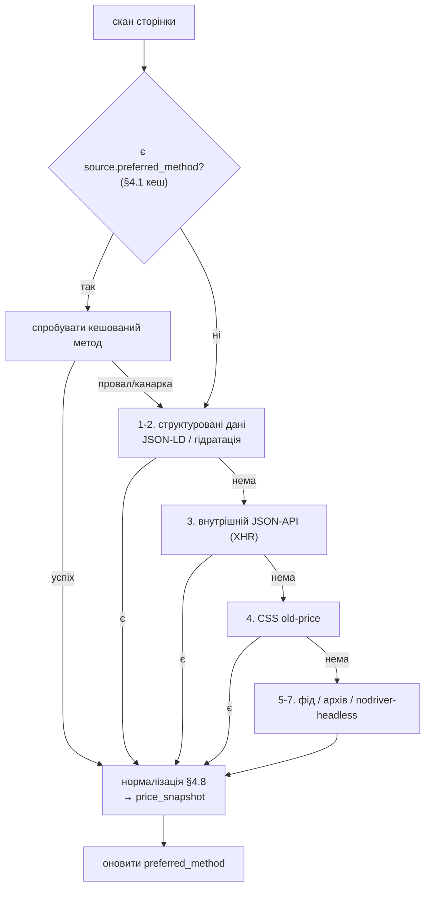

# Розділ 4. Здобуття ціни — каскад методів

Публічних прайс-фідів немає (розділ 3), тож ціну завжди беремо зі сторінки. Але «зі сторінки» ≠ «через CSS-селектор»: є десяток надійніших джерел у тому ж HTTP-запиті. Адаптер крамниці — це **каскад із фолбеком**: пробуємо найстійкіший метод першим, спускаємось нижче лише коли він недоступний.

## 4.1. Каскад (порядок спроб)

```
1. Структуровані дані в HTML   ──🟢 ПЕРШИМ (стандарт, переживає редизайн)
2. Гідратація SPA / вбудований JSON  ──🟢 для JS-вітрин
3. Внутрішній JSON-API (XHR)   ──🟢 де є, найчистіше
4. CSS-селектор old-price      ──🟢 універсальний фолбек
5. Партнерський/платформний фід ──🟡 де доступний (+ монетизація)
6. Архів (ретро-базис)         ──🟡 опортуністично (для нішевих крамниць покриття ~0 — §4.6)
7. Headless (реальний браузер) ──🟡 останній тир (Comfy/Telemart)
```



**Ключова зміна проти «CSS-first»:** структуровані дані (крок 1–2) ламаються значно рідше за верстку, бо магазини кладуть їх для Google і не чіпають при косметичних редизайнах.

> **Кеш обраного методу (не ганяти весь каскад щоразу).** Перебирати кроки 1→7 на кожному скані марно. Метод, що спрацював, кешується в `source.preferred_method` (§6.2); наступні скани йдуть **одразу** ним, а повний каскад re-probe-иться лише коли кешований метод дав збій/просів канарки. Зміна методу при цьому = **явна подія** method-switch (§10.9), а не щоразовий тихий перебір — простіше й діагностовно.
>
> **Декодування ДО парсингу.** Сира відповідь декодується в Unicode **перед** будь-яким витягом: поважаємо `Content-Type`/meta-charset, при розбіжності/відсутності — детектимо (`charset-normalizer`, §8.3). UA-крамниці подекуди віддають windows-1251 — без коректного декоду кирилиця в `title` б'ється й отруює FTS (§9.1) та нормалізацію (§4.8).

## 4.2. Крок 1 — структуровані дані (найстійкіше)

Це вже в сторінці, стандартизоване, машиночитане:

> **Перф-порядок на лістингах:** `extruct` ганяє **всі** парсери (microdata/RDFa/JSON-LD/OG/microformat) — на сторінці з 20–50 картками це вузол. Тому спершу **націлений JSON-LD** (витяг `<script type="application/ld+json">` напряму — швидко, покриває більшість SEO-крамниць), а `extruct` — лише фолбек, коли JSON-LD відсутній чи неповний.

| Метод | Що читаємо | Нота |
|---|---|---|
| **JSON-LD** `schema.org/Product`+`Offer` | `price`, `priceCurrency`, `availability` | `<script type="application/ld+json">`; є у більшості SEO-оптимізованих крамниць |
| **Microdata** `itemprop="price"` | ціна в `content=`/тексті | той самий стандарт schema.org |
| **RDFa** `typeof="Offer" property="price"` | ціна в `content=` | окремий W3C-стандарт; часто на WooCommerce (Rank Math) |
| **Open Graph / meta** `product:price:amount` | ціна | легко, але без старої ціни |
| **Twitter card** `twitter:label/twitter:data` | «Ціна: 1299 грн» | Yoast SEO виводить це на WooCommerce |
| **JSON у `data-*`** `data-product_variations` | поточна+стара ціна **одразу** | WooCommerce variable products; Magento `data-mage-init` |

## 4.3. Крок 2 — гідратація SPA (для JS-вітрин)

JS-фреймворки вбудовують повний стан у сторінку:

- **Next.js** — `__NEXT_DATA__` (Pages Router) або Flight-payload `self.__next_f.push([...])` / `?_rsc=` (App Router).
- **Nuxt** — `__NUXT__` inline або окремий файл `.../_payload.json` (payloadExtraction).
- **SvelteKit** — `.../__data.json` navigation-endpoint.
- **Angular Universal** — `<script id="ng-state">` (TransferState): готовий JSON відповіді product-API.
- **Redux/Vuex/Pinia** — дамп стану у `window.__INITIAL_STATE__`.

Це дає структуровані дані товару без парсингу DOM (E-Zoo, Telemart — тир C з розділу 3 закриваються саме тут, без headless).

## 4.4. Крок 3 — внутрішні JSON-API

Сторінка сама викликає бекенд-ендпоінти; ми викликаємо їх напряму (реверс із вкладки Network або grep JS-бандла):

- **Search-API** — Rozetka `search.rozetka.com.ua/.../api/v6/` повертає структурований JSON (підтверджено, без авторизації).
- **Category/listing XHR** — AJAX, що вантажить товари сторінки акцій.
- **Product-detail / batch-price API** — `/api/product/{id}`, batch-запит цін.
- **Хостований пошук** — Algolia `/1/indexes/*/queries` (search-only ключ лежить у JS-бандлі) або Elasticsearch/Typesense з ціновими фасетами.
- **Платформні API** — WooCommerce Store API `/wp-json/wc/store/v1/products`; Magento GraphQL `products.price_range` (regular+final разом).

> **Мета-прийом:** `grep` JS-бандла крамниці знаходить приховані API-URL і ключі автоматично — один прийом відмикає решту цього кроку.

## 4.4b. Крок 4 — CSS-селектор old-price (універсальний фолбек)

Коли кроки 1–3 недоступні (немає структурованих даних, стан не серіалізовано, API не знайдено) — беремо ціну прямим CSS-селектором картки. Це початковий, найпростіший метод: клас родини `old-price` (`oldPrice`, `old_price`, `price--old`, `card__price-old`, `product-item__price-old`) присутній у ~13/18 крамниць (§3.3) і сам сигналізує «тут знижка», віддаючи поточну+стару ціну. Селектори — per-store конфіг адаптера (`SsrCssAdapter`, §8.4). Мінус — **найкрихкіший метод**: ламається при будь-якому редизайні верстки, тому в каскаді він останній серед «дешевих», перед платними/повільними кроками 5–7. Саме тому кроки 1–2 (структуровані дані) стоять першими.

## 4.5. Крок 5 — партнерські/платформні фіди (ціна + монетизація)

Легальний канал, що інколи дає і ціну, і дохід — **а ще фото з правом показу** (`image_source='feed'`, §4.8/§7.4: найсильніший юридично спосіб показувати товарне фото):
- **Афілійовані мережі** (SalesDoubler — #1 в UA, Admitad, GetSale) — product-feed із цінами + фото + комісія з переходів; умови мереж зазвичай дозволяють показ товарних креативів для промоції (звірити в конкретній програмі).
- **Prom.ua API / Horoshop export** — офіційні експорти для крамниць на цих платформах.
- **Партнерський deeplink-фід** конкретної крамниці (Rozetka/Foxtrot мають партнерки).

> **🔴 Чому фіди — НЕ наш M1-шлях (структурна причина, не тимчасова).** Порівнялки (idealo/PriceSpy) живуть на merchant-фідах, **бо крамниці хочуть трафік** і самі шлють CSV/XML/API. Але наш ціннісний меседж — **викривати накачані знижки** — крамницям **невигідний**: годувати фід інструменту, що показує їхню накачку, вони не поспішать. Тобто feed-тир для нейтральної порівнялки — основа, а для **fake-детектора може бути недоступним/ворожим**. Висновок: **серверний скрейп для нас — структурна необхідність, не bootstrapping-милиця** (принаймні до масштабу/партнерств, коли афіліат-фіди §4.5 дадуть **ціну+дохід** там, де крамниця вже погодилась на партнерство). Стратегічний наслідок — §12.7.
>
> **І: офіційний API історії не дає.** Навіть Keepa скрейпить Amazon для історії, бо Amazon-API віддає лише **поточну** ціну. Rozetka-search-API (§4.4) — так само: поточне, не історія. Тому **історію завжди збираємо проактивно за часом** — це валідує наш підхід, а не обхід.

## 4.6. Крок 6 — архів (опортуністичний ретро-базис)

Механіка: **Wayback CDX API** — bulk-запит снапшотів URL із timestamp/digest (фетч лише коли контент змінився); з архівних снапшотів витягується ціна ретроактивно. **CommonCrawl** — офлайн-витяг без власного краулу.

> **🔑 Backfill — ТІЛЬКИ structured-data (не CSS-селектори адаптера).** Ключова пастка: архівний снапшот несе **розмітку тодішньої версії сайту**, а per-store CSS-селектори адаптера писані під **сьогоднішню** верстку — на снапшоті 6-місячної давнини вони майже напевно не збігаються (і мовчки дадуть 0 або сміття). Тому екстракція з архіву **обмежена кроками 1–2 каскаду** — JSON-LD `schema.org/Product`/microdata/`__NEXT_DATA__` тощо, які **стабільні** через редизайни (магазин тримає їх для Google роками). Практично: (а) снапшот без структурованих даних — **пропускаємо** (не намагаємось CSS); (б) кожна backfill-точка проходить ті самі sanity/дизамбігуацію §4.8 (валюта, ролі цін), плюс `declared_ratio_max` §5.1; (в) `source_method='archive_jsonld'` фіксується в `price_snapshot` для провенансу. Отже реальне покриття backfill = не «скільки снапшотів є», а «скільки снапшотів мали JSON-LD на той час» — ще одна причина, чому для зоо-ніші воно ≈0 (нижче), а для великих SEO-крамниць (M3) — краще.

**Емпірична межа (перевірено CDX-запитами 2026-07-08):** для зоо-MVP покриття **практично нульове** — сторінки акцій MasterZoo/Pethouse мають 0–1 снапшот **на рік**, Zootovary/PetChoice — 0; товарні URL доменів здебільшого мають по одному разовому знімку, з якого 30-денне вікно (≥ `min_reference_points` = 10 точок, §5.2) не збудувати. CommonCrawl для української ніші ще розрідженіший.

Наслідки:
- архів — **не дефолтний шлях**, а разова опортуністична спроба при підключенні джерела: що знайшлося — пишеться з `is_backfill=1`, на решту чекаємо живий збір (~4 тижні до перевірених бейджів; онбординг каже це чесно — §9.6);
- для великих крамниць електроніки (Rozetka/Foxtrot, M3) покриття архіву значно краще — там спроба виправдана;
- зворотний бік — **на користь продукту**: конкурент так само не зможе ретро-відновити історію нішевих крамниць; накопичена БД — актив, який не наздоганяється (§12.3).

## 4.7. Крок 7 — headless (останній тир)

Лише де кроки 1–4 провалились (Comfy/Imperva, JS-only Telemart):
- **`nodriver` (не Playwright)** — актуальний stealth-інструмент 2026: наступник undetected-chromedriver, керує реальним Chrome напряму через CDP (немає `navigator.webdriver`, немає Playwright-WebSocket-містка, який ловлять сучасні детектори). Playwright+stealth-плагін **мертвий** для anti-bot (без оновлень із 03.2023 — звірено 2026-07-09); Camoufox (Firefox-форк, stealth на C++-рівні) — альтернатива, але у 2026 має прогалину в супроводі. Універсальний, але дорогий/повільний — тому останній тир.
- **CDP-attach** до вже запущеного браузера користувача (`--remote-debugging-port=9222` + `Network.getResponseBody`) — реальний браузер, anti-bot не бачить бота (обхід Imperva без stealth-війни). Застереження: лише за явною згодою користувача; відкритий debug-порт — локальна діра в безпеці (до нього може під'єднатися будь-який процес машини); ламається апдейтами Chrome — у каскаді тримати останнім і опційним.
- **Реверс мобільного API** (декомпіл APK → ендпоінти) — апки часто мають слабший anti-bot за веб.

## 4.8. Нормалізація — з тексту в копійки

Будь-який метод повертає сирий рядок ціни; нормалізація — **готовою бібліотекою `price-parser` (Zyte)**: вона з'їдає формати «1 250,50 грн» / «11 499 ₴» / «1.299,50», NBSP-варіанти пробілів і віддає amount+currency; конверсія в копійки — тонка обгортка. Саморобний парсер нижче — ілюстрація семантики і фолбек, якщо бібліотека не розпізнала:

```python
def to_kopiyky(raw: str) -> int:
    # "1 250,50 грн" / "11 499 ₴" / "1250.50"
    s = (raw.replace(" ", " ").replace(" ", "")
            .replace("грн", "").replace("₴", "").strip())
    return int(round(float(s.replace(",", ".")) * 100))     # → 125050
```

Плюс: `external_ref` — стабільний ідентифікатор **з URL** (крос-крамничне зіставлення не потрібне), назва, категорія (мапінг §2.6). Результат кожного проходу — рядок у `price_snapshot` (розділ 6).

> **`external_ref` мусить бути КАНОНІЧНИМ (інакше фрагментація історії).** Сирий URL часто несе волатильні параметри (`utm_*`, `gclid`, `sid`, `?ref=`, якір `#`), що змінюються між заходами. Якщо `ext_ref` = сирий URL, той самий товар отримує **різні** `ext_ref` → `UNIQUE(source_id, external_ref)` (§6.3) створює **дублікати `store_product`** → історія одного товару розривається на кілька, і `reference_kop`/бейдж ламаються. Тому `ext_ref` виводиться з **канонізованого** URL: стабільний ідентифікатор товару (числовий id / slug зі шляху) там, де крамниця його дає; інакше — URL, очищений від tracking-параметрів і якоря, з відсортованими значущими query-параметрами (варіант/розмір лишаємо, tracking викидаємо). Канонізацію робить одна функція (напр. на базі `w3lib.url`), спільна для discovery й baseline, щоб той самий товар з обох поверхонь мапився в один `store_product`.

**Правила валідності ціни (єдині для всіх методів каскаду):**
- **🔑 Дизамбігуація «яку з кількох цін брати» (центральна практична проблема екстракції).** Реальна картка несе **кілька** чисел: поточна, стара (перекреслена), грн/кг (юніт), «бонус/кешбек», «у кредит N/міс», іноді РРЦ. Адаптер МУСИТЬ мати явну карту ролей, а не «перше число». Правила: (а) **поточна ціна** — число в головному ціновому елементі картки (селектор/поле `price`, не `price-old`/`per-kilo`/`credit`); (б) **стара ціна** — лише з елемента родини `old-price` (§3.1) або `priceSpecification`/`highPrice` у структурованих даних; (в) **виключаємо** юніт-ціну (має маркер `/кг`,`/л`,`/шт`), кредитну (`/міс`,`у кредит`,`розстрочк`), бонус/кешбек (`бонус`,`грн на рахунок`) — вони НЕ ціна пропозиції; (г) якщо на картці ≥2 кандидати на «поточну» без однозначного головного елемента → **не пишемо** (флаг `ambiguous_price`, лічильник у `scan_run`), краще пропустити, ніж записати кредитну ціну як роздрібну (сама причина, чому structured-data-first §4.1: там ролі явні — `price` vs `priceSpecification`). Карта ролей — частина конфігу адаптера (§8.9), тестується golden-фікстурою (§8.8).
- **`in_stock` — як визначається (використовується у вікні §5.2, тож обов'язкове).** Джерела за пріоритетом: (1) структуровані дані — `availability` (`schema.org` `InStock`/`OutOfStock`) з JSON-LD/microdata; (2) стан кнопки/мітки на картці — «Купити»/«В кошик» = in_stock, «Немає»/«Очікується»/«Повідомити» = OOS; (3) якщо ціна відсутня, а є лише «Немає» — OOS без ціни (не пишемо ціну). Якщо крамниця **не** розкриває наявність на лістингу — `in_stock` = 1 за замовчуванням із приміткою в конфізі адаптера (`stock_unknown=true`), і §5.2-фільтр OOS для неї фактично не діє (свідома межа, задокументована на джерело).
- **`image_url` — той самий прохід, тирована стратегія (§7.4/§9.2).** Фото-URL приходить безкоштовно зі структурованих даних: пріоритет **фід** (`image_source='feed'`, право показу §4.5) → **JSON-LD `Product.image`** / **`og:image`** / microdata `itemprop="image"` → фолбек `` картки (усі → `image_source='hotlink'`). URL **канонізуємо в абсолютний** (як `external_ref` — protocol-relative/відносні шляхи), беремо стабільний CDN-URL, за можливості **мініатюру** (параметр розміру CDN крамниці — менше байтів, ввічливіше §10.2). Опційно рахуємо `image_blurhash` (колектор тимчасово тягне байти в пам'ять для обчислення — **не** зберігає/не перевіддає їх; хто хоче нуль-дотику — плейсхолдер замість BlurHash). Оновлюється на upsert `store_product` (фото може змінитись); **не** в `price_snapshot` (атрибут товару, не ціновий факт). Битий/відсутній URL — не помилка (best-effort поле): плейсхолдер/BlurHash у UI.
- **Валюта:** якщо метод віддає `priceCurrency` (JSON-LD/API) — приймаємо лише `UAH`; інша/нерозпізнана валюта → пропуск, не факт ціни. Для CSS/тексту (де структурованої валюти немає) `price-parser` НЕ гарантує класифікацію: «грн» — слово, не ISO-символ ₴, тож його currency-детекція може повернути None. Тому для текстового методу **самі** асертимо наявність маркера `грн`/`₴`/`UAH` у рядку ціни; беремо лише `amount`, валюту фіксуємо як UAH за маркером, без маркера → пропуск.
- **Діапазон «від X грн»** (мультиваріантна картка в лістингу): це ціна невизначеного варіанта — **не пишемо** її як ціну конкретного `store_product` (змішування варіантів фабрикує фейкові «знижки» — §5.5). Але **тихо ігнорувати не можна** — інакше мультиваріантні товари в baseline ніколи не наберуть reference-точок і не отримають verified-бейдж (діра покриття). Правило: картку з «від» позначаємо `needs_variant_resolution`; такі товари baseline **не** пропускає, а раз на прохід точково довантажує їх сторінку товару (виняток із «no per-product» §10.8, з жорстким лімітом — §10.8) і пише ціну **кожного варіанта** окремим `store_product`. Однозначну ціну (немультиваріантний товар) пишемо одразу з лістингу.
  - **Як детектимо «від» (три сигнали, будь-який):** (1) текст-префікс `від`/`from`/`~` перед ціною; (2) структуровані дані — `Offer.priceSpecification` з `minPrice ≠ maxPrice`, або `AggregateOffer` з `lowPrice`/`highPrice`; (3) наявність селектора варіантів у картці (`data-product_variations` WooCommerce, `select`/radio ваги/об'єму). Сигнал (2) найнадійніший — за нього й ставимо прапор без здогадів.
  - **Побудова per-variant `external_ref` (щоб історія кожного варіанта була стабільна й не змішувалась):** `external_ref = <канонічний ref товару §4.8> + '#v=' + <variant_key>`, де `variant_key` — **стабільний** ідентифікатор варіанта з розмітки/URL (id варіанта, SKU, або нормалізований параметр `?variant=2kg`), НЕ його порядковий номер (порядок пливе). `variant_note` (§6.3) зберігає людський опис («2 кг»). Так `UNIQUE(source_id, external_ref)` тримає варіанти окремими `store_product`, і `reference_kop` кожного рахується від власної історії.
- **Типи цін:** беремо тільки **публічну безумовну ціну**. «Ціна з карткою лояльності», «ціна в застосунку», ціна за промокодом — не публічна пропозиція в сенсі ч.10 (персоналізовані/умовні ціни ЄС-практика Omnibus теж виключає — §7.8) → не пишемо; селектори/поля адаптера мають явно цілитись у публічну ціну.

## 4.9. Anti-stub / робастність адаптера

Кожен адаптер несе **sanity-гейт**: «очікували ≥ N карток із цінами; отримали 0/3» → не пишемо в базу, піднімаємо алерт «адаптер X зламався» і морозимо джерело (`source.frozen_at`, §10). Це ловить редизайн крамниці до того, як він отруїть історію.
