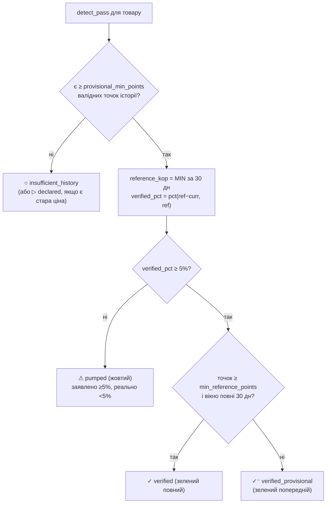

# Розділ 5. Детекція знижки

Ядро продукту. Дві стадії, обидві дають бейдж; друга рахує **статутну формулу** (розділ 7, ч.10 ст.11 №3153-IX), щоб продукт був готовий до активації закону без переробки.

## 5.1. Стадія A — заявлена знижка (день 1)

Працює одразу, без історії, з того, що крамниця показала:

```python
is_declared = (old_price_kop is not None) and (current_kop < old_price_kop)
declared_pct = pct(old_price_kop - current_kop, old_price_kop)   # див. pct() нижче
# бейдж «заявлено крамницею» (нейтральний)
```

> **Округлення (§5.1 і §5.2).** Усі відсотки рахуються через єдину `pct(delta, base)` з `ROUND_HALF_UP` на `Decimal` — **не** вбудованим `round()` (банкірське округлення: `round(2.5)==2` дало б off-by-one на межі порога 5% і в показі). `pct(d,b) = int(Decimal(100*d/b).quantize(0, ROUND_HALF_UP))`.

Гарантує, що додаток **не порожній** з першого запуску: усі перекреслені ціни зі сторінок акцій одразу в переліку, з фільтрами й категоріями.

> **Sanity на заявлену стару ціну (проти сміттєвого `declared_pct`).** `old_price_kop` — це те, що намалювала крамниця, і воно буває або **РРЦ виробника** (не реальна попередня ціна), або **парс-помилкою** (селектор зачепив ціну іншого товару/РРЦ). Оскільки Стадія A показується з дня 1 **до** історії, потрібен захист: якщо `old/current` > `declared_ratio_max` (дефолт 5.0 — «знижка −80%+» на кормі майже завжди артефакт) АБО old < current → `old_price` вважаємо непевним, `declared_pct` **не показуємо** (лишаємо нейтральний «є на акції», без %), лічильник `rejected_declared` у `scan_run`. Це не підміняє Стадію B (вона й існує, бо заявленому вірити не можна) — лише не дає день-1-UI показувати явне сміття. Канон-число — `detection_config.declared_ratio_max`.

## 5.2. Стадія B — верифікація історією (статутна формула)

База (`reference_kop`) береться з **безперервної історії товару** — точки з **обох** поверхонь збору (baseline §3.2/§10.1 **і** discovery: знижений товар сканиться 2×/добу, тож теж наповнює вікно й пришвидшує набір `min_reference_points` на desktop-каденсі — §10.10) плюс опортуністична ретро-набудова з архіву §4.6 для періоду до виявлення — **не** з перекресленої ціни крамниці:

> **Джерело — тільки сирий `price_snapshot` (юр-обороноздатність).** `reference_kop` і бейдж рахуються **виключно з `price_snapshot`**, ніколи з похідного `price_daily` (§6.3): статутне «ціна не була нижчою за X» (ст.277 ЦК, §5.4/§7.5) має спиратися на первинний факт заміру, а не на агрегат. `price_daily` — лише для UI-графіка (§9.2) і швидких оглядів.
>
> **Backfill рахується у вікні.** Ретро-точки з архіву (`is_backfill=1`) **входять** у вікно й у `min_reference_points` — інакше архів (§4.6) не виконав би своєї єдиної функції (набудова 30-денної бази до дня 1). Позначаються в провенансі картки окремо (нижча довіра — §9.2/§10.7); з огляду на ~нульове покриття архіву для зоо-ніші (§4.6) важить переважно для M3-електроніки.

```python
# announce_day — київська цивільна доба анонсу (див. нижче про DST); межа вікна — [announce_day-30d, announce_day)
# 0/битих НЕ беремо (§10.5); out-of-stock НЕ беремо — товар «не пропонувався» (ч.10)
window = [s.price_now_kop for s in snapshots
          if announce_day - 30d <= kyiv_day(s.seen_at) < announce_day
          and s.price_now_kop > 0 and s.in_stock]
if len(window) < min_reference_points:            # напр. <10 валідних точок → ненадійно
    badge = 'insufficient_history'                # НЕ рахуємо (уникає min([]) і поділу на 0)
else:
    reference_kop = min(window)                   # найменша ціна за 30 днів (ч.10)
    # анти-«сходинкове» (ч.11): для СЕРІЇ знижок база = min до ПЕРШОГО анонсу кампанії
    verified_pct = pct(reference_kop - current_kop, reference_kop)   # ROUND_HALF_UP (§5.1)
    # verified_pct ≤ 0 → «знижкова» ціна НЕ нижча (чи вища) за недавній мінімум = найсильніший фейк → pumped
```

> **Таймзона й DST (статутна точність).** `kyiv_day()` конвертує UTC-`seen_at` у цивільну добу через **IANA-таймзону `Europe/Kyiv`** (`zoneinfo`), а не фіксований `UTC+2`: Україна станом на 2025 **не скасувала переведення годинників** (закон №4201 ухвалено ВР 07.2024, але не підписано Президентом — досі діє DST), тож 30-денне вікно, що перетинає ніч на 30.03 чи останню неділю жовтня, містить добу в 23/25 год. Фіксований офсет дав би зсув межі вікна на годину двічі на рік — на статутній формулі це неприпустимо. Перевіряти при кожному релізі, чи закон про скасування DST не набув чинності.

`announce_date` — початок поточного зниження: (а) поява товару на сторінці акцій / active-discount-прапора, **або** (б) якщо прапора немає — інференція з історії (нижче). Виявляє baseline-стеження §3.2; так Стадія B працює й для **незаявлених** знижок (§5.5).

> **Точний алгоритм інференції (варіант б) — щоб не було двозначності в коді.** Ідемо по денних точках товару в хронологічному порядку. Для кожного дня `d` рахуємо `prior_min` = мінімум валідних цін за `[d−30d, d)` (виключно до `d`). День `d` — **кандидат-старт**, якщо `price(d) < prior_min × (1 − min_verified_pct/100)` (ціна впала нижче недавнього мінімуму на ≥ поріг). `announce_date` = перший день серії, де умова тримається `announce_confirm_points` **послідовних** валідних точок (дефолт 2) — щоб один битий снапшот повз §10.5 не створив події. **Крайові випадки, які алгоритм МУСИТЬ обробити:** (1) якщо `prior_min` рахується на < `min_reference_points` точках — не інферуємо (немає бази для «нижче»); (2) «завжди низька» ціна (нема попереднього вищого рівня) → кандидата немає → не подія (узгоджено з §5.5 «постійно знижена»); (3) серія переривається невалідною точкою (OOS/аномалія) — не скидаємо лічильник, а **пропускаємо** невалідну (лічимо валідні поспіль). Прапор (варіант а) має пріоритет над інференцією.

> **`announce_date` відкритої події ФІКСУЄТЬСЯ (критично проти дублів).** `detect_pass` (§8.4) — stateless і перераховує все на кожному проході, але інферований `announce_date` (варіант «б») з приходом нових снапшотів може зсунутися на добу. Оскільки він — частина upsert-ключа `UNIQUE(store_product_id, announce_date)` (§6.4), зсув породив би **дубль/сироту** замість оновлення. Тому: щойно `discount_event` відкрито (`ended_at IS NULL`), її `announce_date` **більше не перераховується** — `detect_pass` шукає активну подію товару за `store_product_id, ended_at IS NULL`, і якщо є — оновлює лише `current_kop`/`reference_kop`/`*_pct`/`badge_state` за наявним `announce_date`. Новий `announce_date` встановлюється тільки коли активної події немає (нова знижка) або попередня закрита за `campaign_gap_days` (§5.5).

## 5.3. Стани бейджа

| Стан | Умова | Що каже користувачу |
|---|---|---|
| **✓ ЗЕЛЕНИЙ** «підтверджено історією» | `verified_pct ≥ 5%` **І** ≥ `min_reference_points` точок за повні 30 днів | реальне зниження від 30-денного мінімуму (повна впевненість) |
| **✓⁻ ЗЕЛЕНИЙ ПОПЕРЕДНІЙ** «попередньо підтверджено» | `verified_pct ≥ 5%`, але точок ≥ `provisional_min_points` (дефолт 4) і < `min_reference_points`, або вікно < 30 днів | зниження підтверджується наявною історією, але її ще мало — бейдж може уточнитись; прибирає «порожній старт» перших тижнів на desktop-каденсі (§14 слабкість №2) |
| **⚠ ЖОВТИЙ** «знижка від завищеної ціни» | `declared_pct ≥ min_verified_pct` (крамниця заявляє знижку ≥ порога) **І** `verified_pct < min_verified_pct` (**включно з ≤ 0**) | ціну накачали; `verified_pct ≤ 0` = найсильніший фейк |
| **○ СІРИЙ** «недостатньо історії» | базис < 30 днів **АБО** < `min_reference_points` валідних точок (дефолт 10) — навіть якщо 30 днів минуло | ще збираємо / історія розріджена |
| **▷ НЕЙТРАЛЬНИЙ** «заявлено крамницею» | лише Стадія A, верифікація ще не рахована | заявлена знижка, перевірка попереду |

> **⚠ Назви станів у цій таблиці — ВНУТРІШНІ (механіка).** Колонка «Що каже користувачу» описує **сенс для розробника**, а не видиму мітку: за **T12/§5.4.1** видимий шар вердикту не висловлює («ціну накачали» / «фейк» — користувач цього не бачить). Енум лишається як є. **Видимі мітки — таблиця в §5.4.1** (реалізовано 2026-07-17).

Поріг 5% — канон (`detection_config.min_verified_pct`), налаштовний; **той самий поріг межує зелений і жовтий** (немає сірої зони «declared 6% / verified 4%»: якщо заявлено ≥ порога, а верифіковано < порога — це жовтий). Нижче порога — шум округлень і мікро-коливань. Гранична умова `verified_pct` рахується `pct()`-функцією з `ROUND_HALF_UP` (§5.1), тож 4,5% → 5% детерміновано, без банкірського off-by-one.



> **Продуктова примітка (не статутне).** База `min` за ч.10 — навмисно жорстка: одноденний глибокий мінімум місяць тому робить чесну сьогоднішню знижку `verified 0%`. Юридично це коректно, але користувачу корисний і другий, нестатутний індикатор «проти типової ціни» (медіана вікна) — як лінії min/avg у Keepa. Кандидат M2+ (§11.4); статутний бейдж не підмінює.

## 5.4. Формулювання — юридично безпечне (ст.277 ЦК)

Бейдж має бути **фактологічним**, не оціночним:

- ✅ «За нашими спостереженнями ціна за 30 днів не була нижчою за **X грн**; заміри 1–2×/добу, N точок історії.»
- ❌ «Фейкова знижка» / «магазин обманює».

Оціночне твердження про конкретну крамницю → ризик претензії про поширення недостовірної інформації (ст.277 ЦК). Тому:
- завжди показувати **provenance**: дата й частота замірів, скільки точок історії, з якого джерела;
- жовтий бейдж каже про **дані** («ціна не була нижчою»), а не про **намір** магазину.

### 5.4.1. Модель B — вердикт не висловлюємо взагалі (T12, 2026-07-17)

**Рішення власника.** Видимий шар **не оцінює**. Ми показуємо виміри — висновок «це накачано» робить покупець у себе в голові, і це **його** оціночне судження, а не наше поширення. Тягар доказу падає з «доведи, що крамниця завищила» до «доведи, що ти це виміряв»; на друге є append-only `price_snapshot`.

- ✅ метрика: «стара ціна трималась **4 доби з 30**», «найнижча зафіксована — **X грн**»;
- ❌ вердикт: «накачана», «знижка від завищеної ціни».

Енум `pumped` лишається в БД/API (внутрішня механіка §5.3) — міняється **лише те, що бачить користувач**.

**Реалізована мапа видимих міток** (`web/index.html`, 2026-07-17):

| Енум (внутрішній) | Чип-фільтр | Пігулка на картці |
|---|---|---|
| `verified` | ↓ Нижче за 30 днів | нижче нашого мінімуму |
| `verified_provisional` | ↓ Нижче · мало даних | нижче мінімуму · даних мало |
| `pumped` | ≥ Не нижче | не нижче нашого мінімуму |
| `declared` | Ще не перевірено | заявлено · ще не перевірено |
| `insufficient_history` | — | історії ще мало |

- **`нашого` — не ввічливість, а юр-суть:** ми не знаємо статутного мінімуму (його має лише продавець), а лише свої виміри (§7.5.1). Мітка без «наш» була б твердженням, якого ми не можемо довести.
- **Символи теж міняються:** `✓`/`⚠` оцінювали («схвалено» / «увага, погано») → `↓`/`≥` описують **виміряне відношення**. `≥` точний: «не нижче» = більше або дорівнює.
- **Сорт називає різницю прямо:** «Наше зниження» (`verified_pct`) vs «Заявлена знижка» (`declared_pct`) — раніше обидва звались просто «знижкою», що змазувало саме те розрізнення, на якому тримається B.
- **Шапка:** «справжні vs накачані» → «знижки проти історії цін» (підзаголовок у шапці був вердиктом).

**Колір теж прибрано** (рішення власника, 2026-07-17). Зелень/бурштин були останнім вердиктом у видимому шарі: «схвалено» / «увага, погано». Усі стани — **однаково нейтральні** (`--grey`); розрізняють **слова**. Клас `b-<state>` знято з розмітки — він існував лише щоб фарбувати. Ціна визнана: продукт гірше сканується очима — за B це свідомий обмін (§5.4.1).

> **🔴 ВІДКРИТЕ, знайдено при цій зміні: єдиний колір на картці тепер — ЗАЯВА КРАМНИЦІ.**
> Прибравши колір з наших вимірів, ми лишили в маркетинговому червоному (`--sale`) тег `−X%`, який показує **`declared_pct` — число крамниці, не наш вимір**. Наслідок видно на картці `pumped`: гучне червоне «−15%» (заява) поруч із тихим сірим «не нижче нашого мінімуму» (наш вимір, що цю заяву спростовує).
>
> **Це не юр-ризик — це перекіс у протилежний бік.** Нейтральність мала б означати «не звинувачуємо і не підспівуємо». Натомість єдиний оцінювальний колір, що лишився, **підсилює заяву крамниці**: ми голосно рекламуємо знижку, яку власні дані не підтверджують. Кут не ст.277, а **захист споживача** — ми стаємо мегафоном непідтвердженої знижки.
>
> Варіанти: (а) знейтралізувати тег; (б) **атрибутувати** («крамниця: −15%») — це не підсилення, а цитата з посиланням на джерело; (в) лишити як є. Рекомендація — **(б)**: тег корисний (це відповідь на «чому це в стрічці»), але мусить читатись як **чужа заява**, а не як наше схвалення. 🧭 рішення власника.

> **Межа B (не обманювати себе).** Добірка теж говорить: назва продукту, опис у сторі й сам факт «у стрічці лише підозрілі позиції» — це твердження через компонування, і суд/модератор дивиться на **загальне враження**, а не лише на буквальні слова. B знижує ставки, але не робить нас невидимими. **Ціна B визнана:** нейтральність слабша як продукт і підвищує ризик Apple 4.2 (S8 Фаза 5).

### 5.4.2. Графік — це головне твердження продукту

Коли вердикт прибрано, **основним твердженням стає графік**, тож він мусить показувати рівно те, що виміряно, і нічого понад:

| Правило | Чому |
|---|---|
| **Сходинки**, не лінійна інтерполяція | інтерполяція малює ціни, **яких ніколи не існувало**; на сходинках кожне намальоване значення — реально виміряне |
| Вісь X **за реальними датами** | інакше прогалина в 5 діб виглядає як одноденний крок — прогалини мусять бути видні |
| Точки видно **завжди** | зникнення маркерів на довгій історії ховає розрідженість саме тоді, коли вона важлива |
| **Пунктир** там, де вимірів не було | тримати значення через прогалину — недоведене твердження |
| База — **нейтральна** (сіра), лише в межах 30-денного вікна | зелень читається як вердикт «добре»; база — це вимір, а не оцінка |
| Підпис: скільки вимірів / за скільки діб / **«між вимірами ціна могла змінюватись — ми цього не фіксували»** | наші дані — **вибірка**, не безперервний запис; статутний 30-денний мінімум достеменно знає лише **продавець**, ми його **реконструюємо зі спостережень** |

> **Ключове.** Кожна точка може бути правдива, а **лінія між ними — ні**. Реалізовано у `web/index.html::sparkline` (2026-07-17).

> **Чесна межа методу (важливо для ст.277).** Якщо крамниця накачала ціну **раніше ніж за 30 днів** до акції й тримала — 30-денне вікно бачить лише накачану ціну, і ми (як і сам закон, ч.10) знижку **не викриємо**. Тому зелений бейдж = «в межах наших спостережень», а не «гарантовано чесна знижка». Архів (§4.6) частково розширює вікно назад, але статутна база — 30 днів. **Ніколи не стверджуємо більше, ніж бачили.**

## 5.5. Крайні випадки

| Випадок | Обробка |
|---|---|
| **Cold-start** (немає 30д історії) | сірий бейдж; спробувати ретро-набудову з архіву (§4.6); Стадія A все одно показує знижку |
| **Товар зник зі сторінки акцій** | знижка завершилась → `discount_event` закривається (`ended_at`), історія лишається |
| **Ціна зросла (не знижка)** | не `discount_event`; лише рядок історії в `price_snapshot` |
| **Стрибок ціни в межах доби** | беремо останній валідний снапшот доби; аномалії (× >5 медіани) → флаг «підозра парсингу», не пишемо як факт |
| **Джерело замерзло** (`frozen_at`) | не оновлюємо ціни цієї крамниці, показуємо «дані застаріли з ДД.ММ», не рахуємо новий бейдж на протухлих даних (§10) |
| **«Сходинкова» знижка** (−10%, потім −20%, −30%) | база = min до першого анонсу (ч.11), а не до кожної сходинки — інакше кожен крок виглядав би як «нова знижка» |
| **Немає старої ціни в HTML** | Стадія A не спрацьовує; Стадія B все одно рахує від власної історії (не залежить від того, що намалювала крамниця) |
| **Різні варіанти (об'єм/вага) під одним URL** | історія ведеться на рівні `store_product` (варіант = окремий id, якщо крамниця дає окремий URL/параметр) |
| **Нова кампанія vs «сходинка»** | якщо ціна поверталась до ~`reference` (не-знижена) на ≥ `campaign_gap_days` (дефолт 7) — наступне зниження = **нова** знижка з новим `announce_date`; безперервне падіння без повернення = «сходинка» однієї кампанії (ч.11) |
| **Постійно знижена («завжди акція»)** | `announce_date` = початок стеження; 30-денне до-вікно порожнє → сірий/insufficient (доки архів §4.6 не дасть базу); не показуємо як «свіжу знижку» |
| **`reference_kop = 0` / порожнє вікно** | guard §5.2: `insufficient_history`, не рахуємо (без `min([])`/поділу на 0) |
| **Товар out-of-stock у частині вікна** | OOS-точки виключаються (§5.2 — товар «не пропонувався»); якщо валідних in-stock точок < `min_reference_points` → `insufficient_history` |
| **Лістинг друкує «від X грн» (мультиваріант)** | ціна-«від» не пишеться як ціна товару; товар позначається `needs_variant_resolution` і резолвиться точковим заходом на сторінку (§4.8, §10.8) — кожен варіант стає окремим `store_product` зі своєю історією (інакше мультиваріантні товари ніколи не отримають verified-бейдж) |
| **«Ціна з карткою» / промокод** | не публічна безумовна ціна → не пишеться (§4.8); і Стадія A, і Стадія B рахуються лише від публічних цін |

> **Точний алгоритм «кампанія vs сходинка» (ч.11 — щоб не було двозначності в коді).** Позначимо день `d` як `discounted(d)` = `price(d) < rolling_min_30d(d) × (1 − min_verified_pct/100)` (та сама умова, що інференція `announce_date` §5.2). **Кампанія** = максимальний прогін днів, де `discounted` тримається, **допускаючи внутрішні розриви коротші за `campaign_gap_days`** (дефолт 7): якщо ціна на 1–6 днів піднялась до не-зниженого рівня й знову впала — це та сама кампанія (сходинка/пауза), не нова. `announce_date` кампанії = **перший** `discounted`-день прогону; `reference_kop` = `MIN` за 30 днів **до** цього першого дня (ч.11 — не до кожної сходинки). **Нова кампанія** починається, лише коли не-знижений рівень (`price ≥ rolling_min_30d × (1 − thr)`) тримається **≥ `campaign_gap_days` поспіль** — тоді наступне зниження відкриває подію з новим `announce_date` і новим `reference`. Внутрішні сходинки (−10→−20→−30 без повернення) — та сама подія, `current_kop` оновлюється, `announce_date`/`reference` заморожені (§5.2). Це робить `step_down_merge` (§5.7) виконуваним, а не декларативним.

## 5.6. Чому історія — незалежна від крамниці

Стадія B **не довіряє** перекресленій ціні крамниці взагалі: `reference_price` рахується з **нашої власної** історії замірів (`price_snapshot`), а не з `price_old_kop`, який показав магазин. Тому навіть якщо крамниця не показує старої ціни або показує накачану — наш зелений бейдж відображає реальне зниження від того, що ми самі спостерігали. Заявлена ціна (Стадія A) — лише для швидкого показу з дня 1 і для виявлення розбіжності «заявлено −50%, а реально −3%» (жовтий бейдж).

## 5.7. Канонічні числа детекції

```
window_days           = 30      # ч.10 ст.11 №3153-IX
min_verified_pct      = 5       # поріг зеленого бейджа
scan_cadence_per_day  = 2       # discovery-заміри/добу (baseline — 1×, §10.8)
anomaly_factor        = 5.0     # × медіани → флаг підозри парсингу
parse_success_floor   = 0.5     # частка валідних цін нижче → джерело морозиться (§10)
systematic_anomaly_frac = 0.3   # частка аномальних цін у scan вище → adapter-break freeze (§10.9)
min_reference_points  = 10      # менше валідних точок у 30-дн вікні → insufficient (§5.2)
provisional_min_points = 4      # ≥ цього, але < min_reference_points → «зелений попередній» (§5.3)
declared_ratio_max    = 5.0     # old/current вище → заявлена стара непевна, declared_pct не показуємо (§5.1)
campaign_gap_days     = 7       # повернення до не-зниженої на ≥N днів → нова кампанія (§5.5)
step_down_merge       = true    # анти-«сходинкове» (ч.11)
announce_confirm_points = 2     # точок нижче rolling-мін підряд для інференції announce_date (§5.2)
exclude_oos_from_window = true  # out-of-stock точки не входять у 30-дн вікно (§5.2/§5.5)
```

Усі — у датованій `detection_config` (розділ 6), змінюються рядком конфігу, не кодом.
