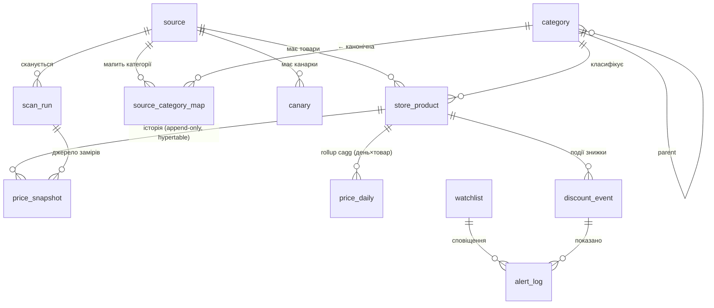

# Розділ 6. Модель даних (schema of record)

СУБД — **PostgreSQL 16 + TimescaleDB**, одна **центральна** керована інстанція (central-only, рішення O1 закрито — §8.10). Підключення — через `DATABASE_URL` (секрет; правила витоку — `workflow/07-conventions.md`, ніколи не в репо). Десктоп-локальний варіант відкинуто (max-privacy-хедж закрито разом з O1). Це канонічна схема; інші розділи посилаються на таблиці за іменами полів. Конвенції: гроші — `*_kop BIGINT` (цілі копійки); час зберігання — `TIMESTAMPTZ` (UTC); цивільні дати (30-денне вікно) — `Europe/Kyiv` через `AT TIME ZONE`; BOOL — нативний `BOOLEAN`; усі config-таблиці датовані (`valid_from`/`valid_to`).

> **⚠ SHIPPED-СХЕМА = `migrations/0001_init.sql` — ЧИСТИЙ PostgreSQL (Neon-free, рішення T11).** `price_snapshot` — **звичайна таблиця** + покривний `ix_ps_prod_window`; `price_daily` **немає** (API/`detect_pass` читають сирий snapshot §5.2). **Timescale-специфіка нижче в §6.3/§6.6** (hypertable / continuous aggregate `price_daily` / компресія) — **DEFERRED `0002` scale-upgrade**, коли обсяг вимагатиме (десятки млн рядків) і буде Timescale-хост; **не в `0001`**. Читаючи DDL нижче: блоки з `create_hypertable`/`timescaledb.*`/`price_daily` cagg — це `0002`-ціль, решта = `0001`.
>
> **Незмінне (і в 0001, і далі):** (1) гроші-цілі гарантує тип `BIGINT`; (2) FTS — нативний `tsvector`+GIN; (3) append-only — тригер+`REVOKE`; (4) міграції форвардні в CI/деплої.

## 6.1. Інваріанти схеми

- Жодних `REAL`/`NUMERIC` для грошей — лише цілі копійки `BIGINT`. Postgres **відхиляє не-цілі в цілочисловий стовпець на рівні типу** (`invalid input syntax for type bigint`) — інваріант «гроші лише цілі» гарантує движок, а не сам лише `CHECK`+конвенція. `BIGINT` (не `INTEGER`) свідомо: `INT4` max ≈ 21.47 млн грн — вузько для сум/агрегатів; `BIGINT` знімає стелю.
- `price_snapshot` — **append-only**: `BEFORE UPDATE/DELETE`-тригер `RAISE EXCEPTION` **+** (глибина оборони) `REVOKE UPDATE, DELETE` з ролі застосунку. Історія незмінна (провенанс ст.277 — §5.2).
- `price_snapshot` (0001) — **звичайна таблиця**, PK = `price_snapshot_id`; покривний `ix_ps_prod_window (store_product_id, seen_at) INCLUDE (price_now_kop, in_stock)` для статутного MIN. *(У deferred-`0002` стає **hypertable** — тоді PK мусить містити `seen_at`.)*
- Крос-крамничного зіставлення немає: `store_product` унікальний **у межах джерела** (`UNIQUE(source_id, external_ref)`).
- Кожна датована config має ≥1 чинний рядок на `today` (deploy-healthcheck-гейт).
- `discount_event` ідемпотентна за `UNIQUE(store_product_id, announce_date)` — ключ upsert-у `detect_pass` (§8.4).
- `reference_kop` (статутний MIN за 30 днів) рахується з **СИРОГО** `price_snapshot`, **не** з `price_daily`-агрегату (провенанс §5.2/§8.6).

## 6.1b. Оглядова ER-діаграма

Візуальна карта зв'язків (деталі полів — у DDL §6.2–6.5; `price_daily` — **continuous aggregate** над `price_snapshot`, не таблиця; повнотекстовий пошук — стовпець `store_product.title_tsv`, тут опущені):



> Поза діаграмою (самостійні, без FK): `detection_config`, `app_config` — датовані конфіги; `http_cache` — кеш умовних запитів.

## 6.2. Джерела та таксономія

```sql
CREATE EXTENSION IF NOT EXISTS timescaledb;   -- має існувати ДО create_hypertable (§6.6)

CREATE TABLE source (                     -- крамниця
  source_id        BIGINT GENERATED ALWAYS AS IDENTITY PRIMARY KEY,
  name             TEXT NOT NULL,
  base_url         TEXT NOT NULL,
  discount_url     TEXT,                  -- сторінка акцій (звідки краулимо)
  platform         TEXT CHECK (platform IN
                     ('horoshop','opencart','woocommerce','magento','bitrix','custom')),
  adapter_kind     TEXT NOT NULL CHECK (adapter_kind IN
                     ('ssr','cookie_challenge','headless','json_api')),
  fetch_tier       TEXT CHECK (fetch_tier IN ('A','B','C')),
  preferred_method TEXT,                  -- кешований метод каскаду, що спрацював останнім (§4.1/§8.4); re-probe лише при провалі
  discovery_cron   TEXT,                  -- каденс discovery-поверхні (акції, §10.1)
  baseline_cron    TEXT,                  -- каденс baseline-поверхні (лістинги категорій, §10.1)
  robots_checked_at TIMESTAMPTZ,          -- дата останньої звірки robots.txt (§7)
  frozen_at        TIMESTAMPTZ,           -- kill-switch: заморозити дані миттєво (§10)
  active           BOOLEAN NOT NULL DEFAULT TRUE,
  created_at       TIMESTAMPTZ NOT NULL DEFAULT now()
);

CREATE TABLE category (                   -- канонічна ієрархія (§2.6)
  category_id   BIGINT GENERATED ALWAYS AS IDENTITY PRIMARY KEY,
  parent_id     BIGINT REFERENCES category(category_id),
  name          TEXT NOT NULL,
  slug          TEXT NOT NULL UNIQUE
);
-- ОБОВ'ЯЗКОВИЙ сід-рядок 'uncategorized' (FK-таргет за замовчуванням).

CREATE TABLE source_category_map (        -- «категорія крамниці → канонічна» (кероване правило)
  source_category_map_id BIGINT GENERATED ALWAYS AS IDENTITY PRIMARY KEY,
  source_id     BIGINT NOT NULL REFERENCES source(source_id),
  store_category_path TEXT NOT NULL,      -- напр. "Акції/Коту/Сухий корм" (для мапінгу/діагностики дрейфу §2.6)
  listing_url   TEXT,                     -- URL лістингу цієї категорії для BASELINE-краулу (§10.1); NULL = не відстежуємо baseline тут
  track_baseline BOOLEAN NOT NULL DEFAULT FALSE,  -- TRUE = ця категорія в baseline-стеженні (§3.2); дискавері бере source.discount_url окремо
  category_id   BIGINT NOT NULL REFERENCES category(category_id),
  UNIQUE (source_id, store_category_path)
);
-- Розподіл поверхонь (§3.2): DISCOVERY краулить source.discount_url (акції); BASELINE краулить
-- listing_url усіх рядків із track_baseline=TRUE. Пагінація baseline — listing_url + ?page=N (§10.1).
```

## 6.3. Товар і історія цін

```sql
CREATE TABLE store_product (              -- товар У МЕЖАХ однієї крамниці (без крос-крамничного зіставлення)
  store_product_id BIGINT GENERATED ALWAYS AS IDENTITY PRIMARY KEY,
  source_id     BIGINT NOT NULL REFERENCES source(source_id),
  external_ref  TEXT NOT NULL,            -- стабільний id з URL/розмітки
  url           TEXT NOT NULL,
  title         TEXT NOT NULL,
  image_url     TEXT,                     -- URL фото (факт-вказівник, НЕ байти твору — §7.4); hotlink, показуємо з крамниці/фіду
  image_blurhash TEXT,                    -- BlurHash-плейсхолдер (~20-30 симв., НЕ твір) — миттєвий фон + фолбек при битому hotlink (§9.2)
  image_source  TEXT CHECK (image_source IS NULL OR image_source IN ('feed','hotlink')),  -- 'feed' = з правом показу (§4.5); 'hotlink' = вказівник на CDN крамниці
  category_id   BIGINT NOT NULL REFERENCES category(category_id),
  variant_note  TEXT,                     -- об'єм/вага, якщо крамниця дає окремий URL/параметр
  needs_variant_resolution BOOLEAN NOT NULL DEFAULT FALSE,  -- TRUE = лістинг дав лише «від X грн» → резолв на сторінці товару (§4.8/§10.8)
  variant_resolved_at TIMESTAMPTZ,        -- коли востаннє резолвлено набір варіантів (кеш проти повторних GET)
  first_seen_at TIMESTAMPTZ NOT NULL DEFAULT now(),
  last_seen_at  TIMESTAMPTZ NOT NULL DEFAULT now(),
  -- пошук за назвою (§9.1 🔍 + watchlist.kind='query'): нативний tsvector замість FTS5.
  -- 'simple'-конфіг: для українських назв товарів без стемера (стемінг тут шкодить: бренди/моделі);
  -- згенерований STORED-стовпець → синхрон автоматичний, БЕЗ external-content-тригерів (пастка SQLite усунена).
  title_tsv     tsvector GENERATED ALWAYS AS (to_tsvector('simple', title)) STORED,
  UNIQUE (source_id, external_ref)        -- ідемпотентність збору
);
CREATE INDEX ix_sp_cat ON store_product (category_id);
CREATE INDEX ix_sp_fts ON store_product USING GIN (title_tsv);
-- (опційно, для підрядкового/друкарського пошуку — pg_trgm GIN по title; вмикаємо за потреби §9.1)

-- канарки: 3–5 відомих товарів/крамницю з очікуваним діапазоном ціни (soft-break detection, §10.9)
CREATE TABLE canary (
  canary_id        BIGINT GENERATED ALWAYS AS IDENTITY PRIMARY KEY,
  source_id        BIGINT NOT NULL REFERENCES source(source_id),
  url              TEXT NOT NULL,
  expected_min_kop BIGINT NOT NULL,
  expected_max_kop BIGINT NOT NULL,
  reviewed_at      TIMESTAMPTZ,           -- остання ревізія діапазону (діапазони протухають — §10.9)
  note             TEXT
);

CREATE TABLE http_cache (                 -- стан умовних запитів ETag/Last-Modified (§10.1)
  url           TEXT PRIMARY KEY,
  etag          TEXT,
  last_modified TEXT,
  fetched_at    TIMESTAMPTZ NOT NULL DEFAULT now()
);

CREATE TABLE scan_run (                   -- один прохід збору по джерелу
  scan_run_id   BIGINT GENERATED ALWAYS AS IDENTITY PRIMARY KEY,
  source_id     BIGINT NOT NULL REFERENCES source(source_id),
  surface       TEXT NOT NULL CHECK (surface IN ('discovery','baseline')),  -- §3.2; статистики/медіани §10.9 рахуються окремо по поверхнях
  started_at    TIMESTAMPTZ NOT NULL DEFAULT now(),
  finished_at   TIMESTAMPTZ,
  status        TEXT NOT NULL CHECK (status IN ('ok','partial','failed','blocked')),
  items_seen    INTEGER NOT NULL DEFAULT 0,
  parse_success_rate DOUBLE PRECISION,    -- частка карток із валідною ціною (sanity-гейт §4.9)
  -- спостережуваність відкинутого (§10.4/§10.5/§10.9): чому історія «зупинилась» — відповідь тут, а не в тиші
  rejected_anomaly  INTEGER NOT NULL DEFAULT 0,  -- × медіани, method-switch stride (§10.5)
  rejected_oos      INTEGER NOT NULL DEFAULT 0,  -- out-of-stock/0-ціна (§5.5/§10.5)
  rejected_currency INTEGER NOT NULL DEFAULT 0,  -- не-UAH/нерозпізнана валюта (§4.8)
  rejected_from_price INTEGER NOT NULL DEFAULT 0,-- «від X грн», відкладено на резолвінг варіантів (§4.8)
  rejected_ambiguous INTEGER NOT NULL DEFAULT 0, -- ≥2 кандидати на «поточну» ціну без головного елемента (§4.8)
  rejected_declared INTEGER NOT NULL DEFAULT 0,  -- заявлена стара непевна (old/current > declared_ratio_max, §5.1)
  http_note     TEXT                     -- коротка діагностика (403/CAPTCHA/timeout)
);

CREATE TABLE price_snapshot (             -- APPEND-ONLY факт ціни (Timescale hypertable, партиція за seen_at)
  price_snapshot_id BIGINT GENERATED ALWAYS AS IDENTITY,
  store_product_id BIGINT NOT NULL REFERENCES store_product(store_product_id),
  price_now_kop    BIGINT NOT NULL CHECK (price_now_kop >= 0),
  price_old_kop    BIGINT CHECK (price_old_kop IS NULL OR price_old_kop >= 0),  -- заявлена стара (Стадія A)
  in_stock         BOOLEAN NOT NULL DEFAULT TRUE,
  source_method    TEXT,                  -- який метод дав ціну (jsonld/api/css/archive…)
  seen_at          TIMESTAMPTZ NOT NULL,  -- час заміру (UTC); колонка партиціонування hypertable
  scan_run_id      BIGINT REFERENCES scan_run(scan_run_id),
  is_backfill      BOOLEAN NOT NULL DEFAULT FALSE,  -- TRUE = ретро з архіву (§4.6)
  PRIMARY KEY (price_snapshot_id, seen_at)  -- seen_at ОБОВ'ЯЗКОВО в ключі (обмеження hypertable, §6.1)
);
SELECT create_hypertable('price_snapshot', by_range('seen_at', INTERVAL '7 days'));

-- ПОКРИВНИЙ індекс для найгарячішого запиту — статутний MIN за 30 днів (§5.2), на кожному скані detect_pass:
-- store_product_id+seen_at у ключі, price_now_kop/in_stock у INCLUDE → index-only scan, без читання рядків.
CREATE INDEX ix_ps_prod_window ON price_snapshot (store_product_id, seen_at)
  INCLUDE (price_now_kop, in_stock);

-- append-only інваріант (§6.1): блокуємо мутації плюс REVOKE як глибина оборони.
CREATE FUNCTION trg_ps_append_only() RETURNS trigger LANGUAGE plpgsql AS $$
BEGIN
  RAISE EXCEPTION 'price_snapshot append-only (спроба % заблокована)', TG_OP;
END $$;
CREATE TRIGGER trg_ps_no_update BEFORE UPDATE ON price_snapshot
  FOR EACH ROW EXECUTE FUNCTION trg_ps_append_only();
CREATE TRIGGER trg_ps_no_delete BEFORE DELETE ON price_snapshot
  FOR EACH ROW EXECUTE FUNCTION trg_ps_append_only();
-- + у ролі застосунку: REVOKE UPDATE, DELETE ON price_snapshot FROM app_role; (деплой-крок §8.10.1)

-- Стиснення холодної історії — НАТИВНА компресія Timescale (замінює ручний delta-encoding §8.6).
-- Свіже 30-дн вікно (статутне, §5.2) лишається неспаканим/гарячим; старші чанки пакуються.
ALTER TABLE price_snapshot SET (
  timescaledb.compress,
  timescaledb.compress_segmentby = 'store_product_id',
  timescaledb.compress_orderby   = 'seen_at DESC'
);
SELECT add_compression_policy('price_snapshot', INTERVAL '30 days');

-- rollup ЛИШЕ для графіка (§9.2) і некритичних оглядів. НЕ джерело для статутного reference_kop:
-- бейдж/reference_kop рахуються з СИРОГО price_snapshot (провенанс для ст.277 — §5.2/§8.6).
-- Continuous aggregate: Timescale сам інкрементально освіжає (detect_pass БІЛЬШЕ НЕ пише price_daily — §8.4).
CREATE MATERIALIZED VIEW price_daily
  WITH (timescaledb.continuous) AS
  SELECT
    store_product_id,
    time_bucket('1 day', seen_at, 'Europe/Kyiv') AS day_kyiv,   -- київська доба (§5.2)
    min(price_now_kop) FILTER (WHERE in_stock) AS min_kop,      -- OOS не входять (§5.5)
    max(price_now_kop) FILTER (WHERE in_stock) AS max_kop,
    last(price_now_kop, seen_at)               AS close_kop,    -- «ціна доби» = остання за seen_at
    count(*) FILTER (WHERE in_stock)           AS n_points
  FROM price_snapshot
  GROUP BY store_product_id, day_kyiv
  WITH NO DATA;
SELECT add_continuous_aggregate_policy('price_daily',
  start_offset => INTERVAL '35 days', end_offset => INTERVAL '1 hour',
  schedule_interval => INTERVAL '1 hour');
-- УВАГА (зміна проти SQLite): close_kop тут = last-by-seen_at, а НЕ method-priority-правило §10.5.
-- Це допустимо, бо price_daily — лише для графіка; статутний розрахунок бере сирий MIN, де правило §10.5
-- застосовує сам detect_pass. Якщо графіку колись знадобиться method-priority-close — рахувати в detect_pass.
```

## 6.4. Подія знижки (детекція)

```sql
CREATE TABLE discount_event (
  discount_event_id BIGINT GENERATED ALWAYS AS IDENTITY PRIMARY KEY,
  store_product_id  BIGINT NOT NULL REFERENCES store_product(store_product_id),
  announce_date     DATE NOT NULL,        -- коли вперше побачили active-discount (київська доба)
  current_kop       BIGINT NOT NULL,      -- ціна на момент розрахунку
  old_declared_kop  BIGINT,               -- заявлена крамницею (Стадія A)
  declared_pct      INTEGER,
  reference_kop     BIGINT,               -- MIN за 30 днів із СИРОГО price_snapshot (Стадія B, ч.10)
  verified_pct      INTEGER,
  badge_state       TEXT NOT NULL CHECK (badge_state IN
                      ('declared','verified','verified_provisional','pumped','insufficient_history')),  -- 'verified_provisional' = зелений попередній (§5.3)
  ended_at          TIMESTAMPTZ,          -- коли знижка зникла зі сторінки акцій
  computed_at       TIMESTAMPTZ NOT NULL DEFAULT now(),
  UNIQUE (store_product_id, announce_date) -- ключ upsert-у detect_pass (§8.4): без нього повторний прохід плодить дублі
);
CREATE INDEX ix_de_state ON discount_event (badge_state, computed_at);
CREATE INDEX ix_de_prod  ON discount_event (store_product_id);
```

## 6.5. Watchlist / алерти / конфіг

```sql
CREATE TABLE watchlist (                  -- користувач стежить за категорією/товаром
  watchlist_id  BIGINT GENERATED ALWAYS AS IDENTITY PRIMARY KEY,
  tg_user_id    BIGINT NOT NULL,          -- Telegram user id (central: багатокористувацький, §8.10)
  kind          TEXT NOT NULL CHECK (kind IN ('category','store_product','query')),
  ref_id        BIGINT,                   -- category_id | store_product_id
  query_text    TEXT,
  min_verified_pct INTEGER DEFAULT 5,     -- поріг для сповіщення
  created_at    TIMESTAMPTZ NOT NULL DEFAULT now()
);
CREATE INDEX ix_wl_user ON watchlist (tg_user_id);

CREATE TABLE alert_log (                  -- що вже показали (анти-повтор ПО СТАНУ бейджа, §9.3)
  alert_log_id  BIGINT GENERATED ALWAYS AS IDENTITY PRIMARY KEY,
  watchlist_id  BIGINT REFERENCES watchlist(watchlist_id),
  discount_event_id BIGINT REFERENCES discount_event(discount_event_id),
  badge_state   TEXT NOT NULL,            -- стан бейджа, ПРО ЯКИЙ сповістили (§5.3)
  shown_at      TIMESTAMPTZ NOT NULL DEFAULT now(),
  UNIQUE (watchlist_id, discount_event_id, badge_state)  -- одне сповіщення на (подія×стан): апгрейд declared→verified = НОВИЙ стан → нове сповіщення, але той самий стан не спамить (§9.3)
);

CREATE TABLE detection_config (           -- датовані числа детекції (§5.7)
  detection_config_id BIGINT GENERATED ALWAYS AS IDENTITY PRIMARY KEY,
  window_days        INTEGER NOT NULL DEFAULT 30,
  min_verified_pct   INTEGER NOT NULL DEFAULT 5,
  scan_cadence_per_day INTEGER NOT NULL DEFAULT 2,  -- discovery-каденс (акції); baseline — 1×/добу (§10.1/§10.8); факт. розклади в source.discovery_cron/baseline_cron
  anomaly_factor     DOUBLE PRECISION NOT NULL DEFAULT 5.0,
  step_down_merge    BOOLEAN NOT NULL DEFAULT TRUE,
  parse_success_floor DOUBLE PRECISION NOT NULL DEFAULT 0.5,   -- нижче → джерело морозиться (§10.3/§10.4)
  systematic_anomaly_frac DOUBLE PRECISION NOT NULL DEFAULT 0.3,  -- частка аномальних цін у scan вище → adapter-break, freeze (§10.9)
  min_reference_points INTEGER NOT NULL DEFAULT 10,   -- менше валідних точок у 30-дн вікні → insufficient (§5.2/§5.3)
  provisional_min_points INTEGER NOT NULL DEFAULT 4,  -- ≥ цього, але < min_reference_points → verified_provisional (§5.3)
  declared_ratio_max DOUBLE PRECISION NOT NULL DEFAULT 5.0,       -- old/current вище → declared_pct не показуємо (§5.1)
  campaign_gap_days  INTEGER NOT NULL DEFAULT 7,      -- повернення до не-зниженої на ≥N днів → нова кампанія (§5.5)
  announce_confirm_points INTEGER NOT NULL DEFAULT 2, -- точок нижче rolling-мін підряд для інференції announce_date (§5.2)
  exclude_oos_from_window BOOLEAN NOT NULL DEFAULT TRUE, -- OOS-точки не входять у 30-дн вікно (§5.2/§5.5)
  valid_from         TIMESTAMPTZ NOT NULL,
  valid_to           TIMESTAMPTZ
);
INSERT INTO detection_config (window_days,min_verified_pct,scan_cadence_per_day,anomaly_factor,step_down_merge,parse_success_floor,systematic_anomaly_frac,min_reference_points,provisional_min_points,declared_ratio_max,campaign_gap_days,announce_confirm_points,exclude_oos_from_window,valid_from,valid_to)
 VALUES (30, 5, 2, 5.0, TRUE, 0.5, 0.3, 10, 4, 5.0, 7, 2, TRUE, '2026-01-01T00:00:00Z', NULL);

CREATE TABLE app_config (                 -- глобальні налаштування (key-value, датовані)
  app_config_id BIGINT GENERATED ALWAYS AS IDENTITY PRIMARY KEY,
  key           TEXT NOT NULL,            -- відомі ключі валідує реєстр у коді (§11.6)
  value         TEXT NOT NULL,
  valid_from    TIMESTAMPTZ NOT NULL,
  valid_to      TIMESTAMPTZ
);
-- сід config-дефолтів (таксономію/крамниці/канарки засіває bootstrap-крок §8.10.1, не міграція):
INSERT INTO app_config (key, value, valid_from, valid_to) VALUES
 ('tz_display','Europe/Kyiv','2026-01-01T00:00:00Z',NULL),
 ('ui_decimal_sep',',','2026-01-01T00:00:00Z',NULL),
 ('ui_thousands_sep',' ','2026-01-01T00:00:00Z',NULL),
 ('csv_bom','1','2026-01-01T00:00:00Z',NULL),
 ('alert_channel','telegram','2026-01-01T00:00:00Z',NULL),   -- central: канал сповіщень = Telegram (§8.10), не 'desktop'
 ('default_category','uncategorized','2026-01-01T00:00:00Z',NULL);  -- онбординг ставить обрану вертикаль
-- Бекап БД — керований Postgres PITR / pg_dump на боці інфри (§8.10.1), НЕ app_config (зникли db_backup_dir/backup_cron/backup_retain).
```

## 6.6. Реєстр міграцій

Міграції — **тільки вперед**, застосовуються **централізовано в CI/деплої** (не користувачем), відстежуються у таблиці `schema_migration(version, applied_at)` (не `PRAGMA user_version` — це SQLite-ізм). Кожна = один `.sql`, у транзакції, ідемпотентна за версією. Уся v2.0-схема створюється **однією** міграцією `0001` (greenfield); `0002+` резервуються під еволюцію, додаються рядком, не переписуванням `0001`.

**Реалії central Postgres** (керована інстанція, деплой контролюємо ми — зникли desktop-специфічні режими §6.6-стара):
- **`CREATE EXTENSION timescaledb` — першим** у `0001` (до `create_hypertable`/continuous aggregate/policy).
- **Порядок у `0001`:** таблиці → `create_hypertable('price_snapshot')` → покривний індекс → append-only тригери + `REVOKE` → компресія + `add_compression_policy` → `price_daily` cagg `WITH NO DATA` + `add_continuous_aggregate_policy` → сіди config.
- **Бекап/відкат:** керовані знімки Postgres (PITR) + `pg_dump` перед ризиковою міграцією (`>0001`) — на боці інфри (§8.10.1), не в застосунку. Міграція, що впала, відкочується транзакцією.
- **Downgrade-guard/version-skip/прогрес-екран міграції** — **знято** (це були реалії локальної desktop-БД під керуванням користувача; central деплой лінійний і контрольований).
- **Важкі міграції на hypertable** (`ALTER TABLE price_snapshot …` по мільйонах рядків / рекомпресія чанків) виконуються у вікні обслуговування; для стиснутих чанків — за процедурою decompress→alter→recompress Timescale.

| # | Файл | Що |
|---|---|---|
| 1 | `0001_init.sql` | `CREATE EXTENSION timescaledb`; **уся v2.0-схема** §6.2–6.5 (`source` (+`preferred_method`), `category`, `source_category_map` (+`listing_url`/`track_baseline`), `store_product` (+фото `image_url`/`image_blurhash`/`image_source`, +`title_tsv` GIN — БЕЗ external-content-тригерів), `canary`, `http_cache`, `scan_run` (+`rejected_*`), `price_snapshot` **hypertable** + PK `(id,seen_at)` + покривний `ix_ps_prod_window` + append-only тригери + `REVOKE UPDATE/DELETE` + компресія-політика, `price_daily` **continuous aggregate** + refresh-політика, `discount_event` (+`verified_provisional`, +UNIQUE-ключ upsert-у), `watchlist` (+`tg_user_id`), `alert_log`, `detection_config`, `app_config`) + сіди (`uncategorized`, `detection_config`, `app_config`; **таксономію M1 §2.6 і крамниці/канарки сідить bootstrap-крок §8.10.1**). Доступ — через пул із `statement_timeout`/`lock_timeout` (§8.2); FK у Postgres чинні завжди (окремий PRAGMA не потрібен). |
| 2+ | *(майбутнє)* | зарезервовано під еволюцію: напр. `0002_electronics_taxonomy.sql` (розширення `category` під електроніку, M3); `0003_source_health.sql` (поля здоров'я адаптера) |

**DoD міграцій:** після `0001` — рядок у `schema_migration` = 1; `timescaledb` встановлено (`SELECT extversion FROM pg_extension WHERE extname='timescaledb'`); `price_snapshot` є hypertable (`SELECT * FROM timescaledb_information.hypertables`) з PK, що містить `seen_at`; append-only тригери є і `UPDATE/DELETE` реально падають (тест — не лише наявність); `REVOKE UPDATE/DELETE` застосовано до ролі застосунку; `store_product.title_tsv` + `ix_sp_fts` (GIN) присутні, пошук §9.1 працює; `discount_event` має `UNIQUE(store_product_id, announce_date)`; `price_daily` cagg існує з refresh-політикою; компресія-політика активна; `scan_run.surface` присутній; кожна датована config (`detection_config`, `app_config`) має ≥1 чинний рядок на `today`; `source_category_map` без сиріт; FK-цілісність (`SET CONSTRAINTS ALL IMMEDIATE` без помилок). **Розподіл сідів:** `0001` засіває лише config-дефолти; таксономію, крамниці й канарки додає bootstrap-крок (§8.10.1) як дані, не міграція.
