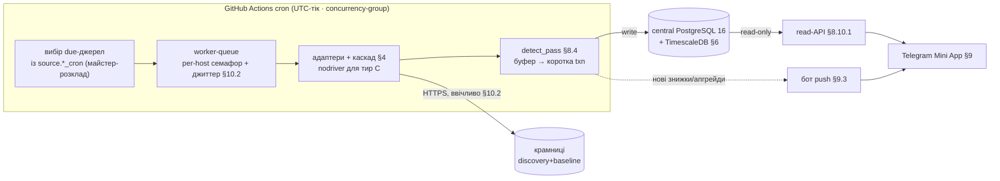
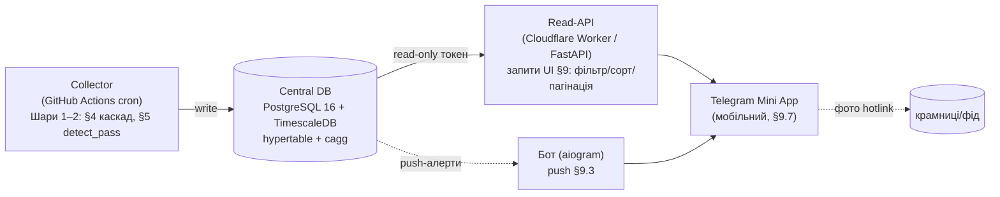

# Розділ 8. Архітектура

> **⚠ Топологія ухвалена (O1 закрито, 2026-07-16): central-only на PostgreSQL 16 + TimescaleDB.** Desktop-локальний варіант **відкинуто**. Первинна й єдина архітектура — **§8.10 / §8.10.1 (central-light)**. Історично-desktop підрозділи (**§8.2** модель процесів, **§8.5** інсталяція, **§8.6** бекап/WAL, **§8.9** канал adapter-config) — **застарілі**: лишені для провенансу, **не в плані**. Топологічно-нейтральні (**§8.1** шари, **§8.3** техстек, **§8.4** контракт адаптера, **§8.7** багатокористувацькість, **§8.8** тести) — чинні, з поправкою на Postgres/Timescale нижче.

## 8.1. Три шари з чіткою межею

Межа між шарами винесена навмисно: **центральний Шар 3 — Telegram Mini App + бот** (§8.10), а Шар 1–2 (збір/детекція) від нього незалежні — фронт замінний без переписування ядра (§8.7).

```
┌─ ШАР 1 · ЗБІР ──────────────────────────────────────────────┐
│ source-адаптери (per-store / платформна родина)             │
│ каскад методів (§4): jsonld → hydration → api → css → архів │
│ scan_run · sanity-гейт · frozen_at kill-switch · rate/cache │
│ пише → raw price + price_snapshot                            │
└───────────────────────────┬─────────────────────────────────┘
                            ▼
┌─ ШАР 2 · ІСТОРІЯ + ДЕТЕКЦІЯ ─────────────────────────────────┐
│ price_snapshot (append-only) · 30-денне вікно (§5)          │
│ discount_event: declared/verified/pumped/insufficient      │
│ detection_config (датовані числа)                           │
└───────────────────────────┬─────────────────────────────────┘
                            ▼
┌─ ШАР 3 · ПРЕЗЕНТАЦІЯ (замінний фронт) ───────────────────────┐
│ ЦЕНТРАЛЬНО: Telegram Mini App — категорії · фільтри ·       │
│   бейджі · watchlist; бот — пуш нових знижок (§8.10)        │
│ (desktop-UI відкинуто разом з O1)                           │
└──────────────────────────────────────────────────────────────┘
```

> Шар 1 має **дві поверхні збору** (§3.2): *discovery* (сторінки акцій — нові знижки, `announce_date`) і *baseline* (лістинги відстежуваних категорій — ціни й не-знижених товарів — база для 30-денної верифікації §5; економіка — §10.8). Шар 2 оновлює бейджі проходом `detect_pass` після кожного `scan_run` (§8.4).

Шар 3 читає лише Шар 2; Шар 1 нічого не знає про презентацію. Заміна фронту не торкається схеми чи детекції.

## 8.2. Модель процесів (central)

Колектор (Шари 1–2) виконується як **GitHub Actions cron-джоб**; споживання — Telegram Mini App через read-API. Немає tray/named-mutex/OS-watchdog/WAL — desktop-механіка відкинута (T10, §00/03). Нижче — центральна модель; топологічно-нейтральні інваріанти (worker-queue, per-host семафор, буфер→коротка txn, довіра до годинника) збережено.



- **Рантайм колектора — GitHub Actions cron.** Workflow тригериться за розкладом, тягне код, ганяє `scan_run` (окремо по поверхнях) і `detect_pass`, пише в central Postgres. Переростемо ліміти GH → копійчаний always-on host (Fly.io/Railway) — той самий колектор, зміна лише деплою (Шар 1 незмінний §8.1).
- **Не-перекриття — GH Actions `concurrency`-group**, не named-mutex: новий прогін того самого workflow не стартує поверх незавершеного (`cancel-in-progress: false` — чекає) → без подвійного збору й ризику бану. Замінює desktop single-instance.
- **Майстер-розклад — у БД (`source.discovery_cron/baseline_cron`).** GH Actions cron — лише часті «тіки» (UTC, мін. ~5 хв, реально ~15 §10.1); на кожному тіку колектор читає, **які джерела due** за їх `*_cron`, і бере лише їх. Один майстер (БД), не два джерела істини (зникає APScheduler+`jobs.sqlite`). Політика пропущених тіків (GH може затримати/пропустити) — catch-up за «останнім успішним збором на джерело» (§10.10).
- **Планування — у UTC (проти DST).** GH Actions cron нативно UTC — DST-пропуск/подвоєння на 01:00–03:00 неможливі. Розподіл: *планування* — UTC; *статутне 30-денне вікно* — `Europe/Kyiv` (§5.2).
- **Модель збору — worker-queue, per-host серіалізація.** Джерела в черзі, N воркерів беруть конкурентно **між хостами**, але **серіалізовано per-host** (семафор на домен + джиттер §10.2 — один запит на крамницю за раз, ввічливість). Масштабується на десятки крамниць (референс — changedetection.io).
- **Запис — Postgres приймає конкурентно** (нема single-writer/WAL-обмеження SQLite). Але `detect_pass` усе одно **буферизує `RawItem` у пам'яті → коротка транзакція** (§8.6): транзакцію не тримати через мережевий I/O. Доступ — через пул (`statement_timeout`/`lock_timeout`); FK у Postgres чинні завжди.
- **«Тиха смерть» колектора — сигнал провалу прогону.** Замість OS-watchdog: (а) GH Actions **сам сповіщає про failed-run** (email/webhook); (б) колектор пише `app_config('collector_last_success_at')`; (в) read-API/Mini App показують «вік останнього успішного збору» і червоніють при застарінні (§9.4); (г) зовнішня канарка (uptime-моніторинг або окремий cron-workflow) алертить, якщо N годин **без жодного успішного прогону**. Закриває «виглядає робочим, але мовчки мертвий».
- **Довіра до годинника (статутна вимога).** `seen_at` штампує GH-раннер (NTP-синхронізований — надійніше за десктоп, але не покладаємось сліпо): при кожному фетчі звіряємо час раннера з `Date`-заголовком крамниці; розбіжність > ~кількох хвилин → скан `clock_suspect` і **не** живить `reference_kop` (бейдж не рахуємо на непевному часі) + алерт оператору.
- **Атомарність і орфани.** Прогін може бути вбитий (GH timeout/скасування) посеред роботи → буфер→коротка транзакція гарантує, що незавершений `scan_run` нічого не лишає в БД (крах під час краулу = нічого не записано; крах під час write-фази = відкат). Осиротілий `scan_run` (`started_at` без `finished_at`) реконсилюється наступним прогоном у `status='failed'` (§8.6), інакше медіани здоров'я (§10.9) рахуються по завислих.
- **UI ↔ дані — on-demand через read-API + push.** Mini App читає через read-API (§8.10.1) на запит; про нові знижки/апгрейди бейджа користувача сповіщає **бот push** одразу після `detect_pass` (§9.3). Немає desktop-файл-маркера/полінгу БД.

## 8.3. Рекомендований техстек

| Шар | Вибір | Чому |
|---|---|---|
| Мова ядра | **Python 3.13+** — **стандартний GIL-білд** (3.14 вийшов 10.2025) | багата екосистема парсингу/HTTP. Free-threaded 3.14 «supported» (PEP 779), але окремий білд і ~51% екосистеми — для I/O-bound скрейпінгу async httpx і так дає конкурентність, тож M1 не гониться за free-threading (звірено 2026-07-08) |
| HTTP | `httpx` **0.28.x (запінити)** або `httpx2` | async, HTTP/2, cookie-jar (Horoshop-челендж). Увага: оригінальний httpx стабільний на 0.28.1 (12.2024), мейнтейнер закрив issues 27.02.2026; супровід підхопив Pydantic як **httpx2** — обрати свідомо, не «останній httpx» (звірено 2026-07-08) |
| Парсинг | `selectolax` (швидкий HTML-парс; ver. 0.4.10, акт. 2026), `parsel`/`lxml` (складніші CSS/XPath для кроку-4 каскаду — selectolax має слабший CSS), `json` (JSON-LD/API), `extruct` (мікродата/RDFa/JSON-LD одним викликом; Scrapinghub, акт. 2025), `price-parser` (нормалізація цінових рядків, §4.8) | покриває весь каскад §4; версії бібліотек звірені 2026-07-08 |
| Headless (тир C) | `nodriver` (НЕ Playwright) — **поза M1-бандлом** | Comfy/Imperva, CDP-attach. `nodriver` — актуальний stealth-2026 (§4.7); Playwright+stealth мертвий для anti-bot (без оновлень із 03.2023). Будь-який headless у PyInstaller = +~130 МБ і крихкий запуск після пакування; тому в M1 **не бандлимо** — Zootovary (тир C з 07.2026, §3.3) беремо **реверсом XHR** (крок 3 каскаду §4). Headless — опційний M3-компонент або CDP-attach до браузера користувача (§4.7) |
| Секрети | `keyring` → Windows Credential Manager (DPAPI, scope CurrentUser) | ключі партнерок (§4.5), проксі-креди (§7.7) — **НЕ** в `app.sqlite` (його бекаплять/шарять) і не в конфіг-файлах |
| Кодування | `charset-normalizer` | UA-крамниці подекуди windows-1251; декод у Unicode **до** парсингу (§4.1), інакше кирилиця в `title`/FTS б'ється; активно підтримується, дефолт у `requests` |
| Шляхи/дані | `platformdirs` (+`SHGetKnownFolderPath`) | `<DATA>`=`%LOCALAPPDATA%\RadarZnyzhok` замість хардкоду `C:\` (§6/§8.5) |
| БД (central) | **PostgreSQL 16 + TimescaleDB** | hypertable `price_snapshot`, continuous aggregate `price_daily`, нативна компресія холодної історії, нативний FTS (`tsvector`+GIN), append-only тригери §6; керована інстанція, PITR-бекап |
| Планувальник | `APScheduler` **3.11.x** (4.x — досі альфа, «not for production»; фізично окремий `jobs.sqlite`) | каденс без окремого демона; `coalesce`/`misfire_grace` — §10.10 |
| UI | **PySide6** або **pywebview/Flet** — природні для Python-ядра (Tauri = Rust-хост + Python-sidecar: два рантайми, зайва складність) | категорії, фільтри, таблиця, бейджі |
| Пакування | one-folder exe (PyInstaller) | чистий Windows без Python; **непідписаний exe = SmartScreen-попередження й антивірусні false-positives** — закласти підпис коду (сертифікат) або чесну інструкцію в онбординг |

Вибір UI-фреймворку — не архітектурне рішення (Шар 3 замінний); критерій — швидка робота з таблицями/фільтрами й простий бандл під Windows. Розглянуті альтернативи для Шару 1: `crawlee-python`/`Scrapy` (politeness/retry/сесії з коробки — виправдані від ~15+ крамниць), `changedetection.io` (референс патернів стеження за ціною; як рушій не підходить — немає нашої моделі історії/детекції); `parsel` (селектор Scrapy) для CSS-кроку каскаду §4 — сильніша підтримка CSS/XPath, ніж у selectolax.

> **Аналітика — нативно в TimescaleDB.** Роль, яку в desktop-плані грали ручний `price_daily` + опційний DuckDB-over-SQLite, тепер закриває сам Timescale: **continuous aggregate** `price_daily` (§6.3) інкрементально освіжається движком; **нативна компресія** тримає десятки млн рядків; віконні `MIN` за 30 днів ідуть по покривному `ix_ps_prod_window` / стиснутих чанках. Статутний `reference_kop` усе одно читає **сирий** `price_snapshot` (§5.2). **DuckDB/Parquet** лишається опційним сайдкаром для важких офлайн-звітів (експорт холодних даних), не для гарячого шляху.

> **Стек central-топології (§8.10, ухвалено O1):** ядро (Python/httpx/парсинг) пише в **PostgreSQL 16 + TimescaleDB** (не SQLite); фронт+push — `aiogram` 3 (Telegram Mini App-бекенд + бот, Шар 3); збір — **GitHub Actions** cron (Шар 1); тести — `VCR.py`+`pytest-recording` (§8.8); середовище — `uv`; секрети — **GitHub Actions secrets / Worker-vault** (не keyring). Рядки таблиці для desktop (Шляхи/`platformdirs`, Секрети/keyring, Планувальник/APScheduler, UI/PySide, Пакування/PyInstaller) — **відкинуто разом із desktop-local (O1)**; ядрові рядки (мова, HTTP, парсинг, headless, кодування) чинні — це колектор.

## 8.4. Контракт адаптера джерела

Кожен адаптер реалізує один інтерфейс, решта конвеєра його не знає:

```python
class SourceAdapter(Protocol):
    source_id: int
    def fetch_discount_pages(self) -> Iterable[RawPage]: ...   # DISCOVERY: краул акцій-секції (§3.2)
    def fetch_category_listings(self) -> Iterable[RawPage]: ...  # BASELINE: краулить source_category_map.listing_url усіх рядків track_baseline=1 (§6.2/§10.1) — саме лістинги, НЕ per-product опитування (§10.8)
    def extract(self, page: RawPage) -> list[RawItem]: ...     # каскад §4 → {ext_ref,url,title,price_now,price_old,in_stock}
    def sanity_ok(self, items: list[RawItem]) -> bool: ...     # §4.9 гейт

# платформні родини = один клас, конфіг на крамницю:
class HoroshopAdapter(SourceAdapter): ...   # спільний fetch (сесійна кука HOROSHOP_PHPSESSID) + JSON-LD-first; config: base_url, discount_url, cat_map, canaries, [selectors-override для теми] (§3.6)
class SsrCssAdapter(SourceAdapter): ...     # Zootovary, Foxtrot, …    (config: selectors)
```

`RawItem` → нормалізація (§4.8) → `store_product` upsert (`UNIQUE(source_id, external_ref)`) → `price_snapshot` insert. Ідемпотентність: повторний прохід тієї ж сторінки не задвоює товар, лише додає новий снапшот часу.

**Прохід детекції (`detect_pass`) — обовʼязковий крок після КОЖНОГО `scan_run`.** Збір лише наповнює `price_snapshot`; бейджі оновлює окрема процедура. Для кожного `store_product` із новим снапшотом `detect_pass` рахує знижку за алгоритмом §5 (Стадія A — з останнього снапшота; Стадія B — `MIN(price_now_kop)` за 30-денним вікном) і **upsert-ить `discount_event`**. Ключ ідемпотентності — `UNIQUE(store_product_id, announce_date)` (§6.4), але **`announce_date` відкритої події не перераховується**: `detect_pass` спершу шукає активну подію товару (`ended_at IS NULL`) і, якщо є, оновлює лише поточні значення за наявним `announce_date` (§5.2 — інакше зсув інференції плодить дублі); новий `announce_date` — тільки для нової знижки. `badge_state` ∈ declared/verified/verified_provisional/pumped/insufficient_history (§5.3). Читає числа з датованої `detection_config`, **поважає `source.frozen_at`** (§10.3 — не рахує бейдж на протухлих даних).

**Закриття подій — тільки за discovery-поверхнею.** `detect_pass` закриває (`ended_at`) активну подію лише коли товар **відсутній на DISCOVERY-поверхні** (акції) у повному (`status='ok'`) проході — не коли він просто не потрапив у baseline-скан (де знижений товар природно може бути відсутнім) і не в `partial`-скані (§10.9). Тому `detect_pass` після baseline-скану бейджі перераховує, але подій **не закриває**; після discovery-скану — і перераховує, і закриває зниклі. `price_daily` (§6.3) `detect_pass` **більше не пише** — це **continuous aggregate**, який Timescale освіжає сам (зміна проти SQLite-плану, де був ручний UPSERT rollup-у; наслідок — `close_kop` = last-by-`seen_at`, не method-priority §10.5, що прийнятно для графіка). Планувальник (§8.2) викликає `detect_pass` одразу після збиральний батч у тій самій послідовності — **без цього кроку `discount_event` лишається порожнім і UI не показує знижок.**

## 8.5. Bootstrap і перший запуск (central-деплой)

Немає інсталятора/`%LOCALAPPDATA%`/mutex — це центральний сервіс, який **розгортає оператор один раз**. Два рівні: **деплой** (оператор) і **онбординг кінцевого користувача** (Telegram, без акаунтів).

**Деплой (оператор, один раз):**
1. **Провізія БД** — керована PostgreSQL 16 + TimescaleDB (§8.10.1). `DATABASE_URL` — у GitHub Actions secrets / vault хоста, **ніколи в репо** (`workflow/07-conventions.md`).
2. **Міграції `0001`** (§6.6): `CREATE EXTENSION timescaledb` → таблиці → `create_hypertable` → індекси/тригери/`REVOKE` → компресія-політика → `price_daily` cagg + refresh-політика → сіди config. Healthcheck-гейт: `schema_migration`=1, extension є, hypertable є, датовані config мають чинний рядок на `today` (DoD §6.6).
3. **Сід вертикалі** — bootstrap-крок вантажить **вбудовані** адаптери (крамниці з `base_url`/селекторами/`source_category_map`/канарками) + таксономію M1 (§2.6) як дані (не міграція). Оператор не конфігурує вручну.
4. **Секрети/канали:** GH Actions secrets (`DATABASE_URL`, афіліат-ключі), bot-token — @BotFather, read-API у своєму vault (§8.10.1).
5. **Перший прогін** GH Actions → `scan_run` по кожному активному джерелу → `detect_pass` (§8.4) → **заявлені знижки (Стадія A) доступні через API/Mini App одразу**; зелені бейджі — після накопичення 30-дн вікна (§5.3).
6. (Опційно) ретро-набудова з архіву (§4.6) — опортуністично, без обіцянки зелених бейджів (для зоо-ніші покриття ~0).

**Онбординг користувача (Telegram, §9.6):** `/start` у бота → відкриває Mini App → вибір вертикалі → перегляд category-first. **Без паролів/реєстрації:** особу дає підписана `initData` (HMAC-звірка на сервері §8.10.1), `tg_user_id` — ключ `watchlist`. Стани порожнечі/помилок — §9.6.

## 8.6. Бекап, цілісність і відновлення (central Postgres/Timescale)

Історія цін (`price_snapshot`) — головний актив продукту (§12.3), тож бекап/відновлення — першокласна вимога, не примітка.

**Бекап — керований PITR + логічний `pg_dump`.** Керована Postgres дає безперервне WAL-архівування → **point-in-time recovery** (відновлення на будь-яку мить). Плюс **періодичний `pg_dump`** (логічний знімок) в об'єкт-стор — друга лінія й портабельність між хостами. Немає SQLite-проблеми «сира копія файлу під час запису» — цим керує сам Postgres.

**Бекап, який не відновлюється, — не бекап.** Періодично **відновлювати `pg_dump` на тимчасову інстанцію** й звіряти (кількість рядків `price_snapshot`, `foreign key`-цілісність, наявність hypertable/cagg). Інакше «бекап є» — ілюзія до першого збою.

**Цілісність — движком, не ad-hoc.** FK/`CHECK` у Postgres чинні завжди; append-only — тригер `RAISE EXCEPTION` + `REVOKE UPDATE/DELETE` (§6.3); типи гарантують «гроші цілі». Міграції йдуть **у транзакції** контрольованим деплоєм; невдала — відкат; катастрофічна — **PITR на мить до деплою**. Autovacuum/`ANALYZE` тримають план запитів на покривному `ix_ps_prod_window` — вручну не смикаємо (нема SQLite-`VACUUM`-локів).

**Реконсиляція осиротілих `scan_run`.** Прогін, убитий посеред скану (GH timeout/скасування), лишає `scan_run` зі `started_at` без `finished_at`. Наступний прогін колектора переводить такі в `status='failed'` — інакше медіани `items_seen` і статистика здоров'я (§10.9) рахуються по завислих. (Топологічно-нейтральне правило, лишається з desktop-плану.)

**Зростання й ретенція — нативна компресія Timescale.** `price_snapshot` дає ~10–25 тис. рядків/добу (§10.8) = ~4–9 млн/рік; за роки — десятки млн. Рішення:
- **Компресія-політика Timescale** (§6.3) стискає чанки, старші за 30 днів (гаряче статутне вікно лишається неспаканим/швидким) — це і є відповідь на масштаб, що **замінює** ручний `VACUUM`/delta-encoding desktop-плану.
- **`price_daily`** — continuous aggregate (§6.3) для графіка (§9.2)/оглядів; статутне 30-дн вікно й `reference_kop` (§5.2) читають **сирий `price_snapshot`**, не агрегат (доказ для ст.277 §5.4).
- **Сирі снапшоти НЕ видаляємо ніколи** — це актив (§12.3) + доказ для ст.277; стискаємо, не прунимо. Дуже старі чанки колись — у **tiered storage Timescale** (дешевий об'єкт-стор), теж **не видалення**.

**Відновлення:**
1. **PITR** — відновити керовану інстанцію на потрібну мить (втрата ≈ 0 при безперервному WAL-архіві).
2. **З `pg_dump`** — логічне відновлення останнього знімка (втрата = від знімка до збою).
3. ~~Ре-бутстрап з архіву~~ — **не працює для нішевих крамниць**: покриття Wayback ~нульове (§4.6); втрачена сира історія не відновлюється — лише живий збір з нуля (30 днів до перших verified-бейджів).

**Атомарність запису (НЕ збору).** Транзакцію не тримати через мережевий I/O. Фази розділені: (1) **краул** робить HTTP-виклики й буферизує `RawItem` у пам'яті (поза транзакцією); (2) лише коли дані зібрані — **коротка** транзакція вставляє `price_snapshot` + `detect_pass` + оновлює `scan_run`, commit атомарно. Крах під час краулу → нічого не записано; крах під час write-фази → відкат. append-only `price_snapshot` (тригер+`REVOKE` §6.3) захищає історію. `price_daily` транзакція не чіпає — Timescale освіжає cagg сам (§8.4).

## 8.7. Сумісність із публічною версією

> ⚠ **O1 закрито: продукт центральний і багатокористувацький із дня 1.** Таблиця нижче («локальний MVP → публічна») лишається як **провенанс переносу ядра**, але «локальна» колонка **не реалізується**. Multi-tenancy — **не** additive-міграція `0002`, а базова: `watchlist.tg_user_id` уже в схемі `0001` (§6.5), авторизація — Telegram `initData` (§8.10.1). Спільні дані (`source`/`store_product`/`price_snapshot`/`discount_event`) — один центральний краул на всіх.

Локальний MVP спроєктовано так, щоб публічна версія (сайт/бот, §12) була **розширенням, не переписуванням**:

| Компонент | Локальний MVP | Публічна версія | Перенос |
|---|---|---|---|
| Адаптери + каскад (§4) | на машині користувача | на центральному сервері | **код без змін**, змінюється розгортання |
| Історія + детекція (§5) | per-user БД | **одна спільна** БД (один краул на всіх) | код без змін; топологія central |
| Презентація (§9) | Windows-UI | веб / Telegram-бот | **новий фронт** над тим самим Шаром 2 |
| Користувачі | один (неявний локальний власник) | багато | **додати** user-вимір (нижче) |

**Multi-tenancy — additive-міграція, не редизайн.** v1.x single-user: `watchlist`/`alert_log`/`app_config('default_category')` неявно належать одному власнику. Публічна версія додає `app_user` + `user_id`-FK на `watchlist`/`alert_log`/преференції **міграцією `>0001`** (напр. `0002_multiuser`, дефолт `user_id=1` для наявних локальних даних). Спільні дані (`source`/`store_product`/`price_snapshot`/`discount_event`/`category`) — **не** per-user, лишаються як є. Тому v1.x-схема forward-compatible: додаємо вимір, не переробляємо.

**Що спрощується.** Один центральний краул обслуговує всіх → нема per-user дублювання збору; БД історії стає ще ціннішим спільним активом (§12.3).

**Що ускладнюється (свідомо поза MVP, але не заблоковано схемою).** Центральна інфра (хостинг/масштаб/anti-ban на обсязі); юр-експозиція — §7.4 (sui-generis «значна частина») і §7.5 (ст.277: публічний показ store-специфічних бейджів багатьом користувачам підвищує ставки, тож формулювання ще консервативніші + механізм відповіді крамниці).

## 8.8. Тестування (DoD скрапінг-продукту)

Для продукту, чия головна крихкість — адаптери, тести будуються навколо **зафіксованих сторінок**, не живих крамниць:

- **Фікстури:** збережені HTML/JSON кожної крамниці (по одній на поверхню й метод каскаду; оновлюються probe-скриптом §3.9) лежать у репо.
- **Golden-тести екстракторів:** фікстура → очікуваний список `RawItem` (ext_ref, ціни в копійках, in_stock). Редизайн ловиться на оновленні фікстури, а не в проді.
- **Тести нормалізації (§4.8):** «1 250,50 грн» / «11 499 ₴» / «від 499 грн» / не-UAH → копійки або відмова.
- **Тести міграцій:** `0001` на чистій Postgres/Timescale-БД проходить DoD §6.6 (`schema_migration`=1, `timescaledb` встановлено, `price_snapshot` — hypertable, append-only тригери реально відхиляють UPDATE/DELETE, `price_daily` cagg + refresh-політика, `tsvector`-FTS).
- **Регресія детекції (§5):** синтетичні історії — сходинка, campaign-gap, OOS-вікно, insufficient, pumped — дають очікуваний `badge_state`; фіксується табличними кейсами. **Час — інжектований параметр, не системний годинник:** «now» і межі 30-денного вікна подаються в детекцію ззовні (fake-clock), інакше тести часозалежні й нестабільні (особливо навколо DST-меж §5.2).
- **Encoding-фікстури:** принаймні одна windows-1251-сторінка серед фікстур — щоб декод (§4.1) і кирилиця в `title`/FTS перевірялись, а не припускались.
- **DoD адаптера перед вмиканням:** фікстура + golden-тест + 3–5 канарок (§10.9) + запис robots-звірки (§3.8).

Живі крамниці в CI не смикаються — живий світ перевіряє probe-скрипт §3.9 за власним розкладом.

**Конкретний інструментарій (2026):**
- **`VCR.py` + `pytest-recording`** (актуальні) — записати реальні HTTP-відповіді крамниць раз у «касети» (YAML) → детерміновано відтворювати в тестах екстракції/каскаду. Так golden-фікстури стають **реальними записами**, а CI лишається офлайн і швидким. Оновлення касети = усвідомлений commit (видно дифф розмітки — сам сигнал редизайну).
- **`probe.py` (§3.9) — перший рядок коду проекту, не останній.** Він валідує ризик №1 (збір) на живих даних **до** написання адаптер-класів, і потім живе як currency-монітор поверхні + канарки (§10.9). Порядок: `probe.py` → `0001` + connection-factory → 1 адаптер (Pethouse) на касетах → `detect_pass` на синтетичній історії.
- **`uv`** — швидке керування середовищем/залежностями (стандарт Python-екосистеми 2026).

## 8.9. Доставка фіксів адаптерів (розв'язання ризику №1)

> ⚠ **На central-топології (O1) цей канал НЕ потрібен:** центральний краул фіксять один раз для всіх — адаптер-фікс = звичайний деплой колектора (§8.10), без доставки на чужі машини. Розділ лишений для провенансу / на випадок max-privacy-десктопу, який відкинуто.

Ризик №1 продукту (§10.6, §12.2) — адаптери ламаються при редизайні крамниць. Desktop-first створює **архітектурну пастку**: виправлений селектор нема як доставити на встановлену машину без повного релізу, а §7.7 забороняє тихі оновлення / phone-home. Без розв'язання кожен редизайн = або зламаний продукт у користувача до наступного релізу, або порушення власної privacy-обіцянки. Розв'язання — розділити **дані** й **код**:

- **Адаптер-конфіг — це дані, не код.** Селектори, каскад-порядок, `discount_url`, `cat_map`, канарки, тир/челендж-параметри виносяться в декларативний конфіг (продовження §3.6/§11.6 до кінця: «магазин на **відомій** платформі = лише дані, новий адаптер-**клас** лише під нову платформу»). Тоді ~90% поломок (зсув селектора, зміна URL акцій) фіксяться **зміною даних**, не бінарника.
- **Окремий канал adapter-config-бандлів.** Підписаний конфіг-пакет (версіонований, напр. `adapters-YYYYMMDD.json` + підпис) тягнеться окремо від застосунку. Оскільки це **декларативні дані, а не виконуваний код**, довіра низька за побудовою — узгоджує §7.7 (жодного виконуваного phone-home) з §10.6 (швидкий фікс). Канал **opt-in, але без тертя**: одна згода при онбордингу («оновлювати правила збору автоматично?»), запит несе лише версію конфігу, без ідентифікаторів (той самий принцип, що оновлення §7.7).
- **Валідація перед застосуванням.** Новий конфіг проходить локально ті самі гейти, що й адаптер (§8.8): канарки (§10.9) + sanity на фікстурі. Не пройшов — не застосовуємо, лишаємось на попередній версії + алерт. Так зіпсований конфіг не гірший за поточний стан.
- **Fallback без каналу.** Хто вимкнув автооновлення — отримує фікси зі звичайним релізом; продукт деградує керовано (freeze зламаного джерела §10.3), не тихо бреше.
- **Плагінна аналогія:** processor-plugin-модель changedetection.io (кожен адаптер — тека + версіонована схема) — робочий референс структури.

**Threat-модель каналу (він сам — supply-chain-поверхня).** Канал оновлень — це вектор компрометації машини користувача, тож має власну безпекову модель:
- **Корінь довіри — вшитий публічний ключ** у бінарнику; бандли підписуються приватним ключем розробника (offline). Клієнт приймає лише валідно підписані — компрометація хостингу без ключа марна.
- **Хостинг — статичний, з мінімальною довірою:** бандл лежить на CDN/статичному сховищі (напр. GitHub Releases); клієнт **не довіряє транспорту** (підпис вирішує), лише HTTPS-цілісність. Це єдине мережеве звернення продукту (§7.7) — без ідентифікаторів, лише версія.
- **Анти-downgrade:** клієнт відхиляє бандл із версією/датою **старшою** за поточну (захист від підсовування старої вразливої/зламаної конфігурації); монотонний лічильник версій у підписаному тілі.
- **Історія й відкат:** останні K відомих-добрих конфігів зберігаються локально; після невдалої валідації (§8.8-гейти) або якщо новий конфіг просадив канарки в проді — **автоматичний відкат** на попередній добрий, не лише «лишитись на поточному».
- **Дані, не код:** бандл — суто декларативний (селектори/URL/cat_map/канарки); **жодного виконуваного коду чи регулярок з backreferences/eval** — парситься суворою схемою, тож навіть підписаний зловмисний бандл не виконує код, лише змінює параметри збору (і ті проходять канарки-гейт).
- **Версіонування схеми бандла (forward/backward-compat).** Схема самого конфігу еволюціонує, а версії застосунку й бандла розходяться (старий застосунок ← новіший бандл і навпаки — та сама проблема, що DB-міграції §6.6, але для конфігу). Тому бандл несе `bundle_schema_version` + `min_app_version`; клієнт **ігнорує невідомі поля** (forward-compat) і **відхиляє бандл, що вимагає новішого застосунку** (`min_app_version` > поточної) з підказкою оновитись — замість тихого збою парсингу.

> На публічній версії (§8.7) проблема зникає: центральний краул фіксять один раз для всіх. Тобто цей канал — **міст**, що дає desktop-MVP витримати maintenance-навантаження, доки/якщо продукт не переїде в центральну топологію.

## 8.10. Топологія — «central-light» (ухвалено, O1 закрито 2026-07-16)

Аналіз слабкостей (§13/§14) показав: три з чотирьох головних ризиків (рідкісний бейдж, силосований рів, крихкий збір на флакі-десктопі) — наслідки **одного вибору топології**. Рішення **O1 закрито**: топологія M1 — **central-light** (збір на керованій машині → **центральна PostgreSQL/TimescaleDB** → споживання без інсталяції через Telegram Mini App). Desktop-версія (§8.1–§8.9-desktop) **відкинута** (не max-privacy-альтернатива, а застаріле). Central-light **дешевший**, не дорожчий, і знімає desktop-крихкість (single-instance, watchdog, WAL-на-чужій-машині, `%LOCALAPPDATA%` — все зникає).

**Збір — GitHub Actions (безкоштовно, найсильніше рішення Тези 3/4):**
- **публічний репо = безлімітні хвилини**; cron (мін. 5 хв, реально ~15 — вистачає для каденсу §10.1); дані пишуться в БД-артефакт/комітяться назад. Наш обсяг (~540 GET/добу, <100 сторінок/прогін — §10.8) — **точно цільовий профіль GH Actions** («VPS потрібен лише від >100 сторінок/прогін»).
- дає **безперервну щільну історію** → зелений бейдж спрацьовує (закриває Тезу 3), і БД **централізована** → рів накопичується, не силосований (закриває Тезу 4).
- переростемо ліміти → копійчаний always-on host (Fly.io/Railway/LiteLambda) — той самий колектор, зміна лише деплою (Шар 1 незмінний, §8.1).

**Фронт — Telegram Mini App + бот (найсильніше рішення Тези 4):**
- **Mini App** (web-UI всередині Telegram) рендерить **повний category-first браузабельний UI §9** — та сама диференціація, що в desktop-таблиці, але **нуль інсталяції** (знімає конфлікт «category-first UX vs легка дистрибуція»); бекенд — `aiogram` 3 (§8.3).
- **бот** пушить нові знижки / апгрейди бейджа (§9.3), Mini App — перегляд/фільтри. Шар 2 незмінний — це новий Шар 3 (§8.1).
- **Фото товару (§7.4/§9.2) — тільки hotlink у Mini App, не `send_photo` ботом.** Mini App (web) вантажить `image_url` браузером користувача прямо з крамниці/фіду — чисто, як веб-сторінка. А `bot.send_photo(url)` змусив би Telegram **завантажити й кешувати** твір на свій CDN (ми спричиняємо копію на третю сторону) — тому бот дає **посилання/картку**, а фото показує Mini App. `image_source='feed'` (право показу) знімає й це застереження.

**Незмінне ядро (Шари 1–2):** уся зрілість §4–§6, §10 переноситься **без переписування** — міняється лише *де* виконується збір (GH Action замість desktop-планувальника §8.2) і *чим* споживається (Mini App замість PySide). Частина desktop-складності (single-instance, dead-collector watchdog, WAL-на-чужій-машині, шляхи `%LOCALAPPDATA%`) на central-light **зникає** — сервер завжди-увімкнений і один.

**Що додається до стеку (§8.3):** `aiogram` 3 (Telegram), GitHub Actions (cron-збір), опційно Cloudflare Workers/D1 чи Fly.io (масштабування). Юр-профіль публічного показу (§7.5 ампліфікація ст.277, §7.4 sui-generis) — той самий, що будь-яка публічна версія: консервативніші формулювання + механізм відповіді крамниці.

### 8.10.1. Архітектура central-light — конкретика (щоб не будувати з абзацу)

Рівень «достатньо, щоб будувати й ухвалити рішення», не 9-підрозділна деталізація desktop. Схема:



- **Сховище (ухвалено, O1):** **PostgreSQL 16 + TimescaleDB** — керована інстанція (напр. Timescale Cloud / self-host на копійчаному VPS), переживає ефемерні GH-прогони **і** дає SQL-доступ read-API. Уся схема §6 (hypertable, continuous aggregate, компресія, `tsvector`-FTS, append-only тригери) — нативна. *(Відкинуті варіанти: комітити `.sqlite` у репо — роздуває git #159; зовнішній R2/S3-файл; Turso/libSQL чи Cloudflare D1 — SQLite-сумісні й дешевші, але обрали повний Postgres+Timescale заради нативної компресії, continuous-aggregate і багатокористувацькості — рішення O1, свідома відмова від desktop-портабельності SQLite.)*
- **Mini App ↔ дані — через тонкий read-API, НЕ прямо з клієнта.** Клієнт **не** отримує токен/прямий доступ до БД (безпека, #32/#34). Між ними — **read-only API** (Cloudflare Worker або мала FastAPI), що виконує саме запити §9 (перелік із фільтром+сортом+пагінацією §9.1, історія картки §9.2) і кешує. Прямий DB-from-client — security smell.
- **Авторизація — модель Telegram, без паролів/акаунтів (§9.6).** Mini App отримує `initData`, підписану Telegram → **верифікуємо на сервері** (HMAC із bot-token) → `telegram_user_id` як ключ `watchlist`. Жодних паролів (§7.7). Це additive-міграція `>0001` (user-вимір §8.7).
- **Деплой/секрети:** collector = `.github/workflows/*.yml`, секрети в **GitHub Actions secrets** (`DATABASE_URL`, афіліат-ключі); read-API = Worker/Fly (секрети в їх vault); bot-token — @BotFather. Мапиться на `workflow/07-conventions.md` (секрети — не в БД/репо; ніколи в git-історію).
- **Свідомо відкладено до валідації (не переспецифіковуємо):** точний host Postgres/Timescale (Timescale Cloud vs self-host vs …), кеш-стратегія API, масштаб — вирішуються на build-кроці; **для S0.1 достатньо найпростішого** (probe пише в локальний Postgres/Timescale, без API). Деталізуємо, **коли** підемо в код фронту, не раніше.

### 8.11. Розглянуті опції з конкурентного розбору (рішення власника 🧭)

Розбір Lume (стек **MV3 + FastAPI + SQLite** — майже наш; open-source) виявив компоненти, яких ми не маємо. Це **опції**, не зобов'язання — рішення власника; закладено адитивно (Шар 1 приймає кілька джерел збору, Шар 3 замінний §8.1).

- **🧭 Гібридний збір — розширення-колектор поверх серверного краулу (найсильніша опція).** Проактивний краул дає **глибину** відстежуваної категорії; додаткове браузерне розширення **пасивно вкладає точки** зі structured-data сторінок, які юзер і так відкрив (як Lume) — **широта + нуль-anti-bot** на тих магазинах. Шар 1 уже приймає такий вхід (`RawItem` із `external_ref`/`image_url`). Наслідок: знімає частину ризику №1 (широта без maintenance), лишаючи нам глибину там, де вона важить. **Це гібрид «краул для глибини + розширення для широти» — потенційно сильніший за будь-якого чистого гравця.** Мінус: другий кодовий фронт (MV3-розширення); тому — після валідації, як опція M2+.
- **🧭 On-page overlay — верифікація «в момент покупки».** Lume перевіряє **на сторінці товару** (overlay), ми — окрема дестинація (Mini App). Легкий overlay-екстеншн доповнив би discovery-вітрину моментом «перевір, поки стоїш на товарі». Опція M2+; той самий Шар 2, ще один Шар 3. **⚠ Якщо overlay + афіліат — обов'язково обійти landmine Honey** (не підміняти куки, надавати цінність, розкривати — §12.6).
- **Study-акселератор:** Lume **open-source** → Виконавець може вивчити його extraction/structured-data-парсинг для нашого §4 (пришвидшує S2, адаптер). `[перевірено: dev.ua]`
