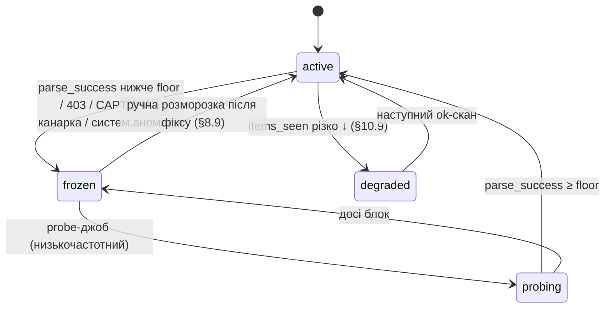

# Розділ 10. Операційка

Найкрихкіший вузол продукту — не алгоритм, а **надійність адаптерів**: кожна крамниця ламається при редизайні, і будь-який агресивний краул може перевести її з easy в hard. Цей розділ — про те, як збирати ціни довго й тихо.

## 10.1. Каденс збору

- **Дефолт:** discovery 2×/добу (ранок/вечір), baseline 1×/добу; розклади окремі — `source.discovery_cron`/`baseline_cron` (§6.2). Ціни в UA-рітейлі не рухаються щохвилини; цього достатньо для 30-денної детекції й щоденного свіжого переліку.
- **Discovery:** краулимо **сторінку акцій** (§3.2): сотні знижок за десятки GET-ів.
- **Baseline:** краулимо звичайні **лістинги відстежуваних категорій** — URL беруться з `source_category_map.listing_url` (рядки `track_baseline=1`, §6.2), не per-product-сторінки! — багато товарів за один GET, ціна й не-знижених. Каденс **1×/добу достатньо** (30-денне вікно = ~30 точок). Обсяг обмежений розміром категорії — не росте без меж (кількісно — §10.8).
- **Пагінація (точні стоп-умови + анти-дубль).** Ідемо `discount_url`/`listing_url` + `?page=N`. **Стоп**, якщо будь-що: (а) сторінка дала **0** товарних карток; (б) усі `external_ref` сторінки вже бачені **в цьому скані** (повна пересічність = кінець або цикл); (в) досягнуто `max_pages_per_scan` (§10.8). **Крос-сторінковий дубль:** лістинг може перетасуватись між сторінками під час краулу (новий товар зверху зсуває решту), тож той самий товар трапляється на page 2 і page 3. Тому в межах скану ведемо `set(external_ref)` вже опрацьованих; повторний `ext_ref` → **пропускаємо** (не другий снапшот того ж товару за скан). Це узгоджено з ідемпотентністю §8.4 (повторний прохід не задвоює), але діє й **усередині** одного скану.
- Джиттер між запитами (напр. 1–4 с рандом), кеш незмінних сторінок за ETag/Last-Modified (стан умовних запитів — таблиця `http_cache`, §6.3).
- **Пріоритезований каденс (техніка Keepa/CamelCamelCamel).** Не всі товари рівноцінні: **активно знижені** (є в `discount_event` з `ended_at IS NULL`) і ті, за якими стежать (`watchlist`), скануються частіше; стабільні не-знижені — рідше. Так фіксований GET-бюджет (§10.8) витрачається на те, що рухається, а не рівномірно. Реалізація: baseline лишається 1×/добу для всієї категорії (дешевий лістинг-краул), а «гарячий» пул (знижені + watchlist) додатково перевіряється в discovery-каденсі — без зростання загального обсягу, бо гарячий пул малий. Дає свіжіші дані там, де вони важать, за ті самі запити.

## 10.2. Ввічливість і anti-ban

| Правило | Чому |
|---|---|
| Браузерний User-Agent, HTTP/2 | виглядати як звичайний клієнт |
| Помірний rate + джиттер | агресивний rate — головний тригер блокування |
| **Жорстка стеля `max_req_per_min_per_host`** (дефолт **12/хв ≈ 1 на 5 с** із джиттером) | конкретний cap, не лише «помірно»: enforced token-bucket-ом на хост у worker-queue (§8.2); при досягненні воркер чекає, не прискорюється. Дефолт глибоко в межах §10.8 (~1 GET/15 хв на крамницю в піку); значення — per-source override в адаптер-конфізі (§8.9) для чутливих крамниць |
| Поважати `robots.txt` (лог `robots_checked_at`) | доказ добросовісності (§7) |
| Не обходити CAPTCHA/авторизацію | ст.361 КК — техзахист не чіпаємо |
| Кеш + умовні запити | менше навантаження на крамницю |
| Backoff при 429/403 | не «довбати» заблоковане джерело |

> **Побічний ризик локального формату:** збір іде з домашнього IP користувача — бан з боку крамниці зачепить і його звичайний браузинг цього сайту. Ще один аргумент ввічливості; опційний проксі (§7.7) ізолює цей ризик, для MVP-обсягу (§10.8) не потрібен.

## 10.2b. Таксономія помилок фетчу (єдина модель)

Робастність скрейпінг-продукту тримається на тому, що кожна помилка обробляється **за своїм класом**, а не «як вийде». Чотири класи, кожен зі своєю реакцією:

| Клас | Приклади | Реакція |
|---|---|---|
| **Transient** | timeout, 5xx, connreset, DNS-збій | in-scan retry з експоненційним backoff (2–3 спроби); не вийшло → скан `failed`, **без freeze**, чекаємо наступний каденс |
| **Rate-limit** | 429, раптовий 403 без редизайну | негайний backoff, до кінця скану джерело не б'ємо; повтор наступного каденсу з довшим інтервалом; серія поспіль → freeze (тимчасовий бан) |
| **Permanent** | редизайн (0 валідних цін), стабільний 403/CAPTCHA, 404 сторінки акцій | freeze джерела (§10.4) + алерт; чекає фіксу адаптера/конфігу (§8.9) |
| **Partial** | lazy-load віддав частину, `items_seen` різко ↓ | `status='partial'`, **не** закриваємо `discount_event` зниклих (§10.9); ретрай наступного каденсу |

Класифікація — перший крок обробки кожної відповіді; далі — механізми §10.4 (sanity-freeze), §10.9 (soft-break), §10.10 (пропущені скани). Це зводить розкидані раніше по §10.2/§10.4/§10.9 реакції в один контракт.

## 10.3. Staleness, kill-switch і стан-машина здоров'я (`frozen_at`)

Проблема: якщо крамниця почала віддавати CAPTCHA / порожнечу / застару сторінку, а ми цього не помітили — детекція рахує бейджі на **протухлих** даних.

**Стан-машина джерела** (durable, у `source`):



**Механізм:**
- Кожен `scan_run` рахує `parse_success_rate` (частка карток із валідною ціною).
- Клас **Permanent/rate-limit-серія** (§10.2b) або `parse_success_rate` < `detection_config.parse_success_floor` (дефолт 0.5) → `source.frozen_at = now` (**миттєво**, не нічним job-ом) + алерт «джерело X замерзло». Канал алертів у M1 — **Windows-toast + червоний індикатор адмін-екрана (§9.4)**; пуш-центр/watchlist-сповіщення — M2.
- Поки `frozen_at IS NOT NULL`: **не оновлюємо** ціни цієї крамниці, показуємо «дані застаріли з ДД.ММ», **не рахуємо** новий `discount_event`.
- **Probe-джоб — окремий низькочастотний планувальник** (не нормальний каденс): раз на ~N годин пробує заморожене джерело одним легким запитом; `parse_success` відновився → `active` (авто-розморозка). Так заморожене джерело не б'ється повним каденсом, але й само повертається, коли крамниця віддала блок.
- Ручна розморозка — після фіксу адаптера/конфігу (§8.9).

Це durable-стан (переживає рестарт): при завантаженні читаємо `frozen_at`, не б'ємо заморожене джерело.

## 10.3b. Спостережуваність і діагностика (ризик №1 — на чужих машинах)

Ризик №1 — **тиха поломка на машинах, яких розробник не бачить**, тож діагностика — архітектурна вимога, не зручність:
- **Структуровані логи** (JSON-рядки: `scan_run_id`, source, surface, клас помилки §10.3, `rejected_*`, тайминги) у ротованому файлі (`<DATA>\logs\`, тобто `%LOCALAPPDATA%\RadarZnyzhok\logs\` — §6/§8.5, не хардкод C:\; добова ротація, ліміт розміру).
- **Export diagnostics bundle** — кнопка на адмін-екрані (§9.4): зіп із логами + останні `scan_run`-рядки + версії адаптер-конфігу (§8.9), **без** PII (`watchlist` не входить) — щоб користувач міг надіслати розробнику для розбору зламаного адаптера.
- Локальність зберігається (§7.7): нічого не йде автоматично, лише за явною дією користувача.

## 10.4. Sanity-гейт адаптера (§4.9)

Перед записом у базу:
```python
if not adapter.sanity_ok(items):        # очікували ≥ N карток із ціною; отримали 0/мало
    mark_scan(status='failed'); freeze_source(source_id, reason='parse_drop')
    alert(f'Адаптер {source.name}: розмітка змінилась (0 валідних цін)')
    return                               # НЕ пишемо — не отруюємо історію
```
Ловить редизайн крамниці до того, як він потрапить в історію як «ціна впала до 0» чи сміття.

## 10.5. Аномалії цін

- Стрибок × > `anomaly_factor` (дефолт 5.0) від медіани останніх N точок → флаг «підозра парсингу», **не** пишемо як факт ціни (щоб один битий парс не зламав 30-денний мінімум).
- Ціна 0 / порожня → пропуск, не 0-грн-«знижка».
- **«Ціна доби» — єдине детерміноване правило (зводить «остання за часом» і «пріоритет методу», щоб не суперечили).** За добу товар може мати кілька валідних снапшотів (discovery + baseline, різні методи). Усі вони йдуть у `price_snapshot` (append-only). Але `price_daily.close` **і** значення для детекції обираються так: **(1) спершу найвищий пріоритет методу** `jsonld/microdata` > `internal_api` > `hydration` > `css` > `archive`; **(2) серед снапшотів цього тир-методу — останній за `seen_at`**. Тобто структуровані дані завжди перекривають крихкий CSS **незалежно від часу** (пізніший CSS не переб'є ранішній JSON-LD), а вже в межах методу — свіжіший. `price_daily.min`/`max` рахуються по **всіх** валідних снапшотах доби (діапазон графіка), лише `close` — за цим правилом. Якщо снапшоти двох методів розходяться > `anomaly_factor` — це не «дві ціни», а **method-switch** (§10.9): нижчий метод не пишемо, hold+review, не даємо йому визначати `close`.
- **Кожне відкидання рахується, не зникає в тиші:** інкремент відповідного `scan_run.rejected_*` (§6.3). Append-only `price_snapshot` лишається чистим, але питання «чому історія крамниці X зупинилась 3-го числа» має відповідь у лічильниках скану, а не потребує ручного розслідування. Різкий стрибок `rejected_*` (не одиничний) — сам по собі сигнал soft-break (§10.9).
- **Систематична** аномалія (велика частка цін scan-у бита, не одна) — це не ринок, а зламаний селектор → freeze всього джерела (§10.9), scan не пишемо.

## 10.6. Обслуговування адаптерів

- **Здоров'я на адмін-екрані** (§9.4): `scan_run.status`, `parse_success_rate`, «остання валідна ціна» на джерело.
- **Платформні родини** (§3.6): фікс спільного механізму/структурованого методу Horoshop-адаптера лікує всі Horoshop-крамниці одразу; правка per-store CSS-селектора (тема-варіація) — лише для тієї крамниці.
- Реалістичний бюджет підтримки: закладати, що 1–2 крамниці на квартал зламаються редизайном і потребують оновлення селекторів/каскаду. Тому каскад §4 будується від найстійкіших методів (JSON-LD/пікселі) — щоб редизайн верстки не завжди ламав збір.

## 10.7. Ретро-набудова (backfill)

Разова **опортуністична** операція при підключенні нової крамниці/категорії (§4.6): Wayback CDX API → усі наявні снапшоти → витяг цін → `price_snapshot` з `is_backfill=1`. Очікування чесні: для нішевих зоо-крамниць покриття ~нульове (0–1 снапшот/рік на сторінки акцій — емпірика §4.6), тож зелених бейджів з дня 1 backfill **не дає**; для великих крамниць електроніки (M3) шанси кращі. Backfill-снапшоти позначені окремо (нижча довіра, ніж живі заміри) і не змішуються з каденс-статистикою.

## 10.8. Економіка навантаження (перевірка, що rate тримає)

MVP: 6 крамниць, 1–2 відстежувані категорії. Обидві поверхні — **лістинг-краули** (багато товарів/GET), не per-product.

> **Бюджет тривалості скану (проти overrun).** Велика категорія (лістинг на тисячі товарів) або повільна крамниця можуть **перекрити наступний запланований скан**. Тому кожен `scan_run` має ліміт — `max_pages_per_scan` і `max_scan_duration` (config); при досягненні скан завершується `status='partial'` (не `ok`), решта добирається наступного каденсу, і §10.9 не трактує недобрані товари як «знижка завершилась». `variant_resolve_budget` (§10.8) — окремий піл-ліміт поверх цього. Так один розрослий лістинг не з'їдає вікно наступних джерел у worker-queue (§8.2).

| Поверхня | Сторінок/крамницю | Каденс | GET/крамницю/добу |
|---|---:|---|---:|
| Discovery (акції, пагінація) | ~10–25 | 2×/добу | ~20–50 |
| Baseline (лістинги категорій) | ~15–40 | 1×/добу | ~15–40 |
| **Разом** | | | **~35–90** |

**6 крамниць × ~90 = ~540 GET/добу** (пік). Рознесені по 24 год = **~23/год по системі** (≈1 запит кожні ~2–3 хв усього; **~1 на 15 хв на окрему крамницю**) — глибоко в межах ввічливості (§10.2), непомітно на тлі реального трафіку крамниці.

**Точок ціни:** лістинг-сторінка несе 20–50 товарів, тож ~540 GET дають **~10 000–25 000 точок/добу** по 6 крамницях — надлишок для 30-денних вікон.

**Чому НЕ per-product baseline:** опитування кожного відомого товару окремою сторінкою = 1 GET/товар, а множина «товарів, що будь-коли були в акції» росте **монотонно й без меж** → десятки тис. GET/добу за місяці → бан. Лістинг-краул категорій обмежений розміром категорії (фіксований) і в 10–100× дешевший. Тому baseline = лістинги, не product-pages.

**Обмежений виняток — резолвінг мультиваріантів (§4.8).** Товари, що в лістингу дають лише «від X грн», інакше ніколи не наберуть reference-точок. Для них — точковий захід на сторінку товару, але **обмежений**, не «всі колись-знижені»: (а) лише товари з прапором `needs_variant_resolution`, (б) резолв кешується (`external_ref` варіантів фіксується — повторно сторінку не смикаємо, доки набір варіантів стабільний), (в) жорсткий денний ліміт `variant_resolve_budget` (дефолт ~50 GET/крамницю/добу) поверх лістинг-краулу. Так множина зростання лишається обмеженою (унікальні мультиваріантні товари категорії — фіксований набір), не монотонною. Якщо ліміт вичерпано — решта резолвиться наступними днями; `log()` скільки відкладено (§10.9-принцип «no silent caps»).

**Масштабування:** кожна нова крамниця/категорія додає ~лінійно; проксі не потрібен на MVP-обсязі (§11.5). Червона лінія — не наш rate, а редизайни адаптерів (§10.6, §10.9), не навантаження.

## 10.9. Робастність до редизайну: soft-breaks і канарки

Kill-switch (§10.3) і sanity-гейт (§10.4) ловлять **hard-breaks** (0 цін, CAPTCHA, 403 → freeze). Небезпечніші — **soft-breaks**: редизайн, після якого адаптер *щось* парсить, `sanity_ok` проходить, але значення ХИБНІ (селектор тепер чіпляє ціну розстрочки/бонуса замість старої; змінилась одиниця грн/кг↔грн/шт; lazy-load віддав частину). Такі пишуть правдоподібне сміття, тихо зсувають 30-денний мінімум і псують verified-бейджі. Hard-break безпечний (freeze); soft-break корумпує історію — тому потрібен окремий шар.

**Канарки (golden-перевірка).** Кожен адаптер має 3–5 «канарок» — відомих товарів з очікуваним діапазоном ціни (таблиця `canary`, §6). Кожен scan звіряє канарки; вихід за діапазон = **негайний freeze**, навіть якщо загальний count у нормі. Ловить selector-drift-на-хибний-елемент, який count-гейт §10.4 пропускає. **Обслуговування канарок:** діапазони протухають (інфляція, ротація асортименту) — ревізія при кожному фіксі адаптера і планово раз на квартал (`canary.reviewed_at`, §6.3); канарка, що зникла з асортименту, замінюється; freeze оголошується за виходом ≥2 канарок за діапазон (одна зникла/змінена — алерт на ревізію, не freeze).

**Систематична аномалія.** §10.5 флагує ОДНУ биту ціну. Якщо ж частка аномальних цін scan-у > `systematic_anomaly_frac` (дефолт 0.3) — це не рух ринку, а зламаний селектор → **freeze + не писати весь scan**.

**Метод-switch.** `price_snapshot.source_method` логується. Якщо для товару метод змінився (напр. jsonld→css) І значення стрибнуло — методи читають різні поля → **hold + review**, не пишемо як зміну ціни.

**Частковий скан.** `scan_run.items_seen` порівнюється з ковзною медіаною попередніх прогонів **тієї ж поверхні** (`scan_run.surface`, §6.3 — discovery й baseline мають різні обсяги, спільна медіана безглузда); різко менше (lazy-load недовантажив) → `status='partial'`, і **не** трактуємо «зниклі» товари як «знижка завершилась» (не закриваємо їх `discount_event`). Закриття подій узагалі відбувається лише за повним (`ok`) **discovery**-сканом (§8.4) — baseline і partial подій не закривають.

| Сценарій редизайну | Симптом | Запобіжник |
|---|---|---|
| Верстку змінено, `old-price` зник | 0 валідних цін | sanity-гейт §10.4 → freeze |
| Cloudflare/Imperva ввімкнули | 403 / CAPTCHA | kill-switch §10.3 → freeze |
| Селектор чіпляє ціну розстрочки/бонуса | ціни правдоподібні, але хибні | **канарка** + систематична аномалія |
| Одиниця змінилась (грн/кг↔шт) | значення × N | канарка (діапазон) + систематична аномалія |
| Lazy-load віддає 8 із 50 | `items_seen` ↓ | частковий скан → не закривати `discount_event` |
| JSON-LD зламано, CSS дає інше поле | стрибок при method-switch | метод-switch hold |
| Локаль/валюта зламали парсер чисел | 0 або × сміття | нормалізатор §4.8 reject + sanity-гейт |

**Пріоритет:** канарка (найточніша, ловить тихе) → систематична аномалія → метод-switch → частковий скан. Усі ведуть до freeze/hold + алерт, **ніколи** — до тихого запису. Принцип: **краще пропустити оновлення, ніж записати хибну ціну** — бита історія псує бейджі надовше, ніж пропущений день.

## 10.10. Пропущені скани (десктоп — не сервер)

Локальний формат означає: ПК спить, вимкнений або додаток закритий — сканів немає. Це штатна ситуація, не збій, і вона керується:

- **Автостарт у треї** (§8.2) — базова умова; ставиться онбордингом з явною згодою користувача.
- **Catch-up при старті:** якщо останній `scan_run` поверхні старший за її каденс — один позачерговий скан одразу після запуску. Саме **один**, не серія «надолужень» за всі пропущені дні (ввічливість > повнота, §10.2).
- **Misfire-політика планувальника:** `coalesce=true`, великий `misfire_grace_time` — пачка пропущених тригерів схлопується в один запуск (§8.3).
- **Дірки в історії — чесні:** довгі прогалини природно деградують бейджі до `insufficient_history` (захист `min_reference_points`, §5.2) — це коректна поведінка, не баг; UI показує банер прогалин (§9.6).
- **Метрика здоровʼя:** частка днів із ≥1 успішним baseline-сканом за останні 30 дн — на адмін-екрані (§9.4); хронічно < ~70% → чесна підказка користувачу, що verified-бейджі будуть рідкісними (і аргумент за міграцію збору на завжди-увімкнену машину/сервер — §8.7).

> **Проєктне напруження: `min_reference_points`=10 проти desktop-каденсу (§5.7 × §10.10).** 10 валідних точок за 30 днів при baseline 1×/добу = потрібен успішний скан **кожні ~3 дні**. На домашньому ПК з прогалинами це реально провалюється → зелений бейдж стає рідкісним **з інфраструктурних, а не ринкових причин**, підриваючи головну обіцянку. Три пом'якшення (у порядку переваги): (1) **discovery-точки теж живлять reference** (§5.2) — знижені товари сканяться 2×/добу, отже набирають точки швидше; (2) поріг `min_reference_points` — у `detection_config`, тож для desktop-профілю його можна свідомо знизити (напр. 6), приймаючи трохи більший шум заради покриття; (3) чесний UI прогалин + метрика здоров'я вище. Це фундаментальна причина, чому **центральний збір (§8.7) якісно кращий за local-first** — сервер не має прогалин, і той самий поріг дає щільнішу історію.
